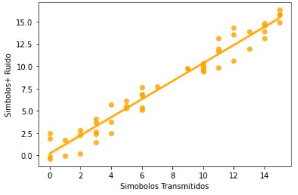

Usamos Google Colab para realizar el código de Python y comenzamos utilizando las librerías tradicionales como `pandas`, `numpy`, `seaborn` y una librería nueva como `scipy.stats`, para usar los algoritmos estadísticos de esta [librería](https://docs.scipy.org/doc/scipy/reference/stats.html?highlight=scipy%20stats#module-scipy.stats).

```python
import pandas as pd
import numpy as np
import matplotlib.pyplot as plt
import seaborn as sns
import scipy.stats as st
```

> Para esta articlase modelamos un problema de telecomunicaciones usando una modulación de 16 PAM, esto quiere decir que existirá 16 niveles de tensión a transmitir que hipotéticamente serán de 0 a 16 [V], por cuanto introducimos ruido gaussiano a cada símbolo con una densidad de potencia de 1 W/Hz. es decir $\sigma^2 = 1$.

```python
np.random.seed(50)
var1 = np.random.randint(0,16,50) # Simbolos Transmitidos PAM
var2 = var1 + np.random.normal(0,1,50) 
# Ruido Introducido, Simbolos + Ruido de densidad espectral de 1 W/Hz
```

## Visualización de Resultados con un Intervalo de Confianza del 80%

Para visualizar los resultados hacemos uso de la regresión lineal con `sns.regplot()` eh enviado nuestro parámetro de intervalo de confianza (conficence interval CI) en el método de regresin.

```python
grafico = sns.regplot(var1, var2, ci=80, color='orange')
plt.ylabel('Simbolos+ Ruido')
plt.xlabel('Simobolos Transmitidos')
```



Para descartar los datos atípicos, hacemos uso del intervalo de confianza y sus limites inferior y superior. De manera que generamos primero una tupla.

```python
tuple = list(zip(var1,var2))
tabla = pd.DataFrame(tuple,columns=['Simbolos Transmitidos','Señal + Ruido'])
tabla.head()
```

Hacemos uso de la libreria de scipy.stats con `st`, usando una distribuciones de variables continuas `t`, y por ultimo usamos el metodo `interval` para hallar el intervalo de confianza (confidence interval CV).

Si la cantidad de muestras es menor a 30, usamos:

```python
  st.t.interval(alpha, df, loc, scale)
```

Mientras que si la cantidad de muestras es mayor a 30 usaremos: 

```python
  st.norm.interval(alpha, loc, scale)
```

Como usaremos valores mayores a 50, entonces usaremos `st.norm.interval` en donde sus parametros a analizar seran:

- `alpha = 0.95`: Esto debido a que se quiere un IC con un indice del 95%.
- `loc = np.mean(tabla)`: Enviamos el parametro de la media para ue nos devuelva los limites de acuerdo a la caracteristica del conjunto de datos.
- `scale = st.sem(tabla)`: Error estándar de la media $SE = \frac{\sigma}{\sqrt{n}}$, esto nos indica que el error de muestreo disminuye cuando crece el numero de muestras.

```python
# 95
st.norm.interval(alpha = 0.95, loc = np.mean(tabla), scale = st.sem(tabla))
```

$IC_{95\%}(6.85 ; 8.22) \ | \ Símbolos \ Transmitidos$

$IC_{95\%}(7.14 ; 8.57) \ | \ Símbolos + Ruido$

Esto nos menciona los valores mínimo y máximo de voltaje que pueden tener los símbolos transmitidos y al pasar por un canal de característica gaussiana.

## Reto - Cálculo para otros niveles de significación

### Para un indice de confianza del $(1-\alpha)=68\%$

```python
#68
st.norm.interval(alpha = 0.68, loc = np.mean(tabla), scale=st.sem(tabla))
```

$IC_{68\%}(6.85 ; 8.22) \ | \ Símbolos \ Transmitidos$

$IC_{68\%}(7.14 ; 8.57) \ | \ Símbolos + Ruido$

### Para un índice de confianza del $(1-\alpha)=99.7\%$

```python
#99.7
st.norm.interval(alpha = 0.997, loc = np.mean(tabla), scale=st.sem(tabla))
```

$IC_{99.7\%}(5.49 ; 9.58) \ | \ Símbolos \ Transmitidos$

$IC_{99.7\%}(5.73 ; 9.98) \ | \ Símbolos + Ruido$

**Contribución realizada por:** David Castillo
