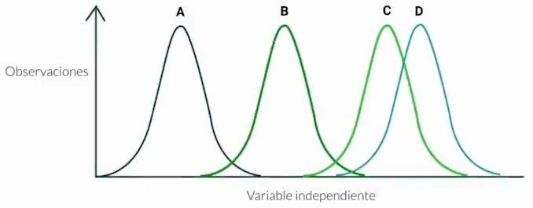

Si recuerdas en la **prueba de hipótesis**, realizabamos la comparación de nuestra muestra de acuerdo a una distribución hipotética, y con ello obteniamos la significacia de valor obtenido en la muestra y con cuanto de error podria ser falsa dicha hipotesis (Valor-P). También se planteo un rango para la hipotesis Nula, y cuando se debia escoger la hipotesis Alternativa.

Como complemento a esto, existe los tipos de prueba de hipótesis de acuerdo a otros parámetros, y estos se aplicaran cuando nos haga falta alguna información, o cuando tengamos variables categoricas.

Los tipos de pruebas de hipótesis son:

- t de student
- Validación ANOVA
- Coeficiente de Pearson

## t de Student

Tambien conocida como distribución t, es **utilizada para aproximar el valor de la media** de una **muestra pequeña**, es decir que no tiene muchos elementos, ademas que se **desconoce la desviación típica**. Esta distribución seguira la forma de una distribución normal y la variable a evaluar sera:

$$
t=\frac{(x_1-x_2)}{\sqrt{\frac{(s_1)^2}{n_1}+\frac{(s_2)^2}{n_2}}}
$$

Este puede tener varios grados de libertad ($k$), el grado definira la forma de la curva de la distribución.

## Coeficiente de Pearson

El coeficiente de Pearson o tambien llamado **coeficiente de correlación**, es uno de las parámetros mas utilizados para observar los comportamientos entre variables y cuanto se afectan entre si, herramientas como la **matriz de correlación** nos pueden ayudar a observar cuanto se afectan $n$ variables **cuantitativas** entre si. El caso mas fácil es realizar el coeficiente de correlación de dos variables, por ejemplo de (x,y) configurado por:

$$
r=\frac{\sum (x-\bar{x})(y-\bar{y})}{\sigma_x \sigma_y}
$$

Es importante acotar que si las variables a analizar son de distinta dimesiones (por ejemplo una sea medida en metros/segundo y otra medida sea de lumenes, u otra sea de pascales) se debe proceder a **normalizarlas** (dividir cada elemento para el maximo elemento de la muestra) y ahi si ejecutar el coeficiente de pearson.

Existe **3 diferentes comportamientos** que puede tener el coeficiente de correlación:

1. Correlación Directa (r es positivo)
2. Correlación Inversa (r es negativo)
3. Correlación Nula (r = 0)

Y ademas de tiene 2 diferentes **grados de correlación**:

1. Correlación Fuerte: r se encuentra entre 0.6 a 0.8
2. Correlación Debil: r se encuentra entre 0 y 0.6

Con esto en mente podemos armar una tabla con estas especificaciones. 

| Coeficiente | Grado de Correlación | Tipo de Correlación |
| ----------- | -------------------- | ------------------- |
| r=1         | Perfecta             | Directa             |
| 0.8<r<1     | Muy alta             | Directa             |
| 0.6<r<0.8   | Alta                 | Directa             |
| 0.4<r<0.6   | Moderada             | Directa             |
| 0.2<r<0.4   | Baja                 | Directa             |
| 0<r<0.2     | Muy Baja             | Directa             |
| r=0         | Nula                 |                     |
| 0<r<-0.2    | Muy Baja             | Indirecta           |
| -0.2<r<-0.4 | Baja                 | Indirecta           |
| -0.4<r<-0.6 | Moderada             | Indirecta           |
| -0.6<r<-0.8 | Alta                 | Indirecta           |
| -0.8<r<-1   | Muy alta             | Indirecta           |
| r=-1        | Perfecta             | Indirecta           |

## Análisis de la Varianza (ANOVA)

Se utiliza para realizar la comparación de variables entre las medias de diferentes grupos, es decir **la comparación de diferentes ditribuciones** obtenidas de distintas muestras.

Este análisis lo vimos en la anterior clases, realizando comparaciones y observaciones en los rangos de acpetación de la hipotesis nula, y con las colas bilaterales y unilaterales.

**Contribución realizada por:** David Castillo