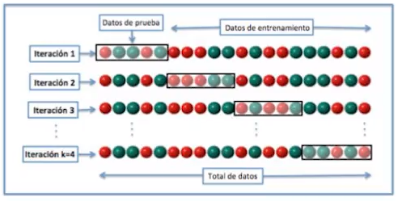

La **Validación Cruzada** la utilizaremos para **demostrar que nuestros datos de prueba son independientes de los datos de entrenamiento**. La validación cruzada es utilizada al final de tu análisis. Hay que recordar que en la inteligencia artificial creamos dos tipos de grupos un **grupo de prueba** y otro **grupo de entramiento**. 

Correspondientemente un grupo ajustara las propiedades del otro, y tenemos que validar que dicha predicción de modelo ajustamos mas a un modelo de origen.

## Procedimiento de la Validación Cruzada

1. Se divide los datos en k grupos de un mismo tamaño.

2. Se usaran $k-1$ grupos para realizar el entrenamiento del modelo y uno de ellos se usara para validarlo.

3. El proceso tiene que repetirse un total de k veces usando un grupo distinto como validación para cada iteración.

De esta manera realizamos una validación cruzada entre los grupos, repitiendo k veces hasta llegar a un resultado en donde los grupos de prueba y entrenamiento se ajusten lo máximo posible.

**Colaboración realizada por:** David Castillo
