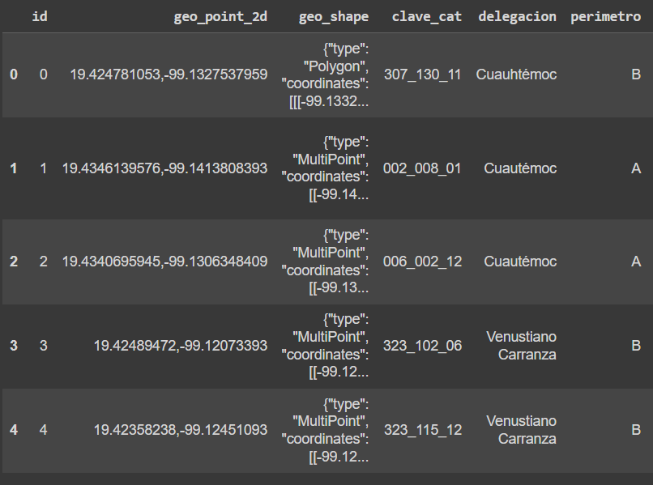
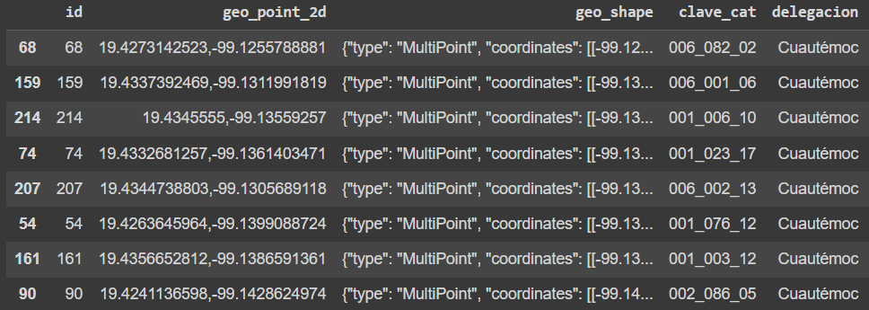
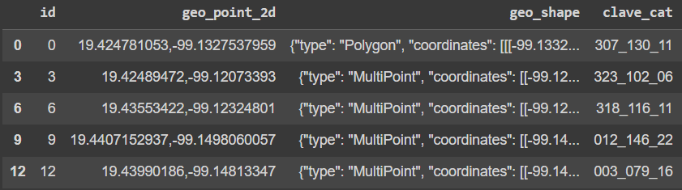

Para codificar las tres funciones de muestreo (Aleatorio Simple, Sistemático y Estratificado) en Python usaremos cuadernos de codificación, el que se usara sera Colab, aunque también se puede utilizar Jupiter Notebook o DeepNote.

Se recomienda Google Colab o DeepNote porque en ellas no es necesario instalar las librerías que se van a utilizar.

## Librerias a utilizar

Las librerías a utilizar serán pandas, numpy, random para generar números aleatorios y io para convertir nuestro documento csv en un objeto binario.

```python
import pandas as pd
import numpy  as np
import random
import io
```

Luego descargamos la set de datos de `econdata.csv` que podemos descargarlo en este [enlace](https://static.platzi.com/media/public/uploads/econdata_ea911019-5acc-4c3e-94c1-4bae1896d167.csv). Este set de datos procederemos a cargarla en nuestro Google Colab. A través del método `upload`.

```python
from google.colab import files
uploaded = files.upload()
```

Hacemos uso del método `BytesIO` del modulo `io` para codificar nuestro documento *Econdata.csv* en un objeto binario (Si deseas saber mas sobre los objetos binarios, te dejo el siguiente [enlace](https://docs.python.org/3/glossary.html#term-bytes-like-object)). Despues leemos este este archivo codificado en objeto binario a través del método de `read_csv` y lo trataremos como un **dataframe** con el modulo de `pandas`.

Si observamos cuantos registros existen en este dataframe, nos vamos a encontrar que tiene 230 registros. Mostramos los primeros 5 registros del datafame `econdata` a través del método `head()`.

```python
econdata = pd.read_csv(io.BytesIO(uploaded["Econdata.csv"]))
# Los 5 primeros registros
econdata.head()
```



## Muestreo Aleatorio Simple

Para realizar el muestreo aleatorio simple hacemos uso del método `sample` del modulo `pandas`, recordemos que convertimos nuestro archivo en un dataframe. Por cuanto al aplicar el método `sample(n=8)` seleccionaremos 8 registros aleatorios del dataframe. Por si te da curiosidad, te dejo la documentación del método `sample` en este [enlace](https://pandas.pydata.org/docs/reference/api/pandas.DataFrame.sample.html).

```python
aleat_8 = econdata.sample(n=8)
aleat_8
```



Cada momento que ejecutemos esta linea se seleccionara 8 registros distintos del dataframe.

Ahora podemos escoger un grupo de registros de acuerdo a una fracción de este, recordemos que nuestro dataframe tiene 230 registros, si queremos seleccionar un 25% de todos registros y que se seleccionen de manera aleatoria, insertamos el atributo `frac=0.25` dentro del método `.sample()`. En este caso nos lanzara un dataframe de $250*0.25=57.5\approx58$ registros que lo nombraremos `prop_25`.

```python
prop_25 = econdata.sample(frac=.25)
print('Dataframe de longitud de '+str(len(prop_25)))
prop_25.head()
```


## Muestreo Sistemático

Recordemos que el muestreo sistemático se selecciona a través de un intervalo, definimos una función con parámetros `econdata,step`, pasamos el dataframe con el parámetro `econdata` y seleccionaremos las posiciones de los registros con el parámetro de `step`. Por ejemplo si seleccionamos un `step=3`, tendremos los siguientes registros con posiciones:

$econdata[0]$
$econdata[3]$
$econdata[6]$
...
$econdata[225]$
$econdata[228]$

Generamos un dataframe `systematic_sample` donde seleccionaremos los registros de `econdata` con las posiciones seleccionadas en `step`, devolvemos este dataframe con las muestras realizadas sistemáticas.

```python
def systematic_sampling(econdata,step):
  indexes = np.arange(0,len(econdata),step=step)
  systematic_sample = econdata.iloc[indexes]
  return systematic_sample

systematic_sample = systematic_sampling(econdata, 3)
systematic_sample.head()
```




