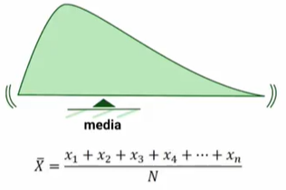
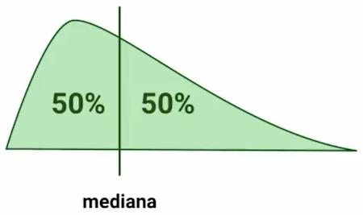

Para comprender de mejor manera cual es la **media muestral** tenemos que reforzar los conceptos de **media, la moda y la mediana**.

## Que es la Media?

La **media** es la suma de todos las observaciones dividida por el numero total de observaciones, es decir $\bar{X} = \frac{1}{N}\sum_{i=1}^{N}x_i$.

Por ejemplo si deseas saber el promedio de calificaciones, donde tuviste 3 pruebas con calificaciones de 7, 8 y 9, entonces el media seria realizar $(7+8+9)/3=8$. 

La media podemos utilizarla en muchos contextos, por ejemplo la media de la duración de las canciones que escuchas.

## Que es la Moda?

La **moda** sera el dato que mas veces se repite en un experimento, por ejemplo si realizas una encuesta en una universidad y te encuentras con que haz encuestado a 15 personas de 20 años y a 10 personas de 21 años, eso quiere decir que la moda es personas de 20 años.

## Que es la Mediana?

Es el dato que se encuentra en el centro de todos. Es decir que encontraremos el dato que se encuentre en la mitad de todo el conjunto de datos resultantes. Un ejemplo seria si tengo un conjunto de datos de $\{1,2,3,4,5\}$, aquí la mediana sera el numero 3. Existen dos formulas para el calculo de la mediana de acuerdo al numero de observaciones, si es un numero par o impar.

$x_{(N+1)/2}$, si N es impar

$\frac{1}{2}(x_{N/2}+x_{N/2+1})$, si N es par 

## Que es la Media Muestral?

La media muestral es también llamada media aritmética, promedio o simplemente media, y se trata de sumar todos los valores de un conjunto cuantitativo y dividirlo para numero total de los valores que existan.

Hay que mencionar que la **media muestral** $\bar{X}$ es distinta a la **media poblacional** $\mu$, recuerda el concepto de **muestreo** significa una extracción de toda la población. Por ello tomamos una muestra de la población y de esta obtenemos su media.

### Calculo de la varianza y desviación estándar.

Para el calculo de desviación estándar muestral utilizamos.

$s=\sqrt{s^2}=\sqrt{\frac{\sum_{i=1}^{n}(x_i-\bar{x})^2}{n-1}} $

Para el calculo de la desviación estándar poblacional, se utiliza:

$\sigma=\sqrt{\sigma^2}=\sqrt{\frac{\sum_{i=1}^{N}(x_i-\mu)^2}{N}}$

**Contribución realizada por:** David Castillo
