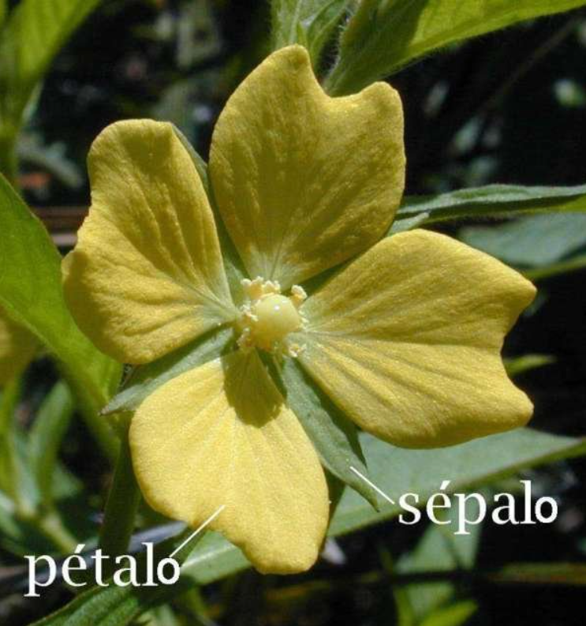
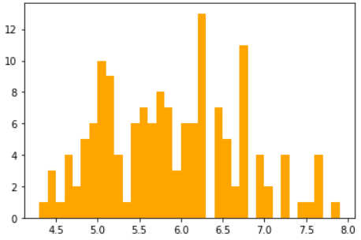
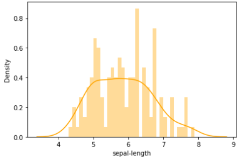
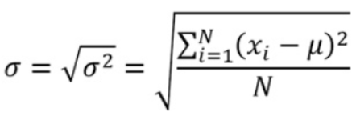
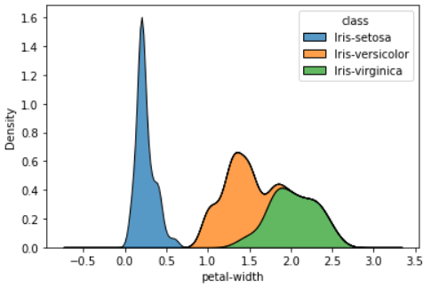

Para realizar el calculo de la varianza, desviación estándar y media tanto muestrales como poblacionales en Python, utilizaremos el cuaderno de Código de Google Colab. Llamaremos a las librerías necesarias como pandas, numpy, matplotlib y seaborn.

```python
import pandas as pd
import numpy as np
import matplotlib.pyplot as plt
import seaborn as sns
```

Luego cargaremos un set de datos muy conocido en el mundo de la ciencia de datos, que tiene nombre `iris`. Hacemos uso de la librería de pandas y su método de lectura de documentos CSV `pd.read_csv()`.

```python
url = 'https://archive.ics.uci.edu/ml/machine-learning-databases/iris/iris.data'
names = ['sepal-length','sepal-width','petal-length','petal-width','class']
iris = pd.read_csv(url, names=names)
```

Al cargar los primeros 10 registros tendremos:


Podemos realizar una inspección de la extracción de la variables de interés, por ejemplo tenemos 4 variables que indican parámetros de medición  de la longitud y ancho de los sepalos y petalos, con un 3 diferentes clases Iris Sentosa, Iris Versicolor y Iris Virginica.



Entonces ya conocidas las variables, las distinciones entre que es un sépalo y un pétalo, podríamos encontrar los estadísticos descriptivos de estas los parámetros de medición.

```python
plt.hist(iris['sepal-length'],color='orange',bins = int(180/5))
```



## Gráfico de Kernel Density

El gráfico de la densidad de Kernel es una estimación del histograma a través de una variable continua. Haremos uso de librería seaborn cono el método de `.distplot()`.

```python
sns.distplot(iris['sepal-length'],hist=True,kde=True,bins=int(180/5),color='orange')
```



## Varianza y Desviación Estandar Poblacional

La expresión para hallar la variación es la siguiente:


Utilizaremos los métodos de pandas para el calculo de la variación y desviación estándar, para ello tendremos que observar el método `.var()` y `.std()` tienen un parámetro `ddof`, el cual sera el divisor `N-ddof`, por defecto este parámetro sera 1, como la formula tanto de la desviación estándar como varianza poblacional el divisor es N, entonces debemos acotar el colocar un `ddof=0` en el parámetro que le pasemos al método.

```python
iris['sepal-length'].var(ddof=0)
```

Con un resultado de $\sigma^2=0.68$. Para obtener la desviación estandar sera:



```python
iris['sepal-length'].std(ddof=0)
```

Obteniendo un valor de $\sigma=0.82$. Ahora para hallar la media usaremos el metodo de `.mean()` que propociona el uso de la libreria de pandas.

```python
iris['sepal-length'].mean()
```

Con un resultado de media poblacional de $\mu = 5.84$. Ahora como sabemos si nuestra desviación de datos es alta o baja, pues usaremos un parametro conocido como coeficiente de variación.

## Coeficiente de Variación

### Calculo del coeficiente de variación

$$
C_V = \frac{\sigma}{\mu} *100\%
$$

- Si $C_V$ es menor o igual al 30%, se dice que la media aritmética es representativa del conjunto de datos, y se llama al conjunto de datos como **Homogeneo**. 
- Por otro lado, si $C_V$ es mayor al 30% la media no sea representativa en el conjunto de datos, y resultara en un conjunto **Heterogeneo**

```python
coef_var = iris['sepal-length'].std() / iris['sepal-length'].mean()

if (coef_var <= 0.3):
  print(str(coef_var.round(2))+'\n'+'La media es representativa y se trata de un conjunto Homogeneo')
else:
  print('La media no es representativa y se trata de un conjunto Heterogeneo')
```

Con esto hallamos que el $C_V = 14\%$ que es menor al 30%, por cuanto la media es representativa, nos encontramos con un conjunto Homogeneo y ademas tenemos una desviación baja.

## Creación de una muestra usando muestreo aleatorio simple

Si recodamos los tipos de muestro que existen, el mas sencillo era utilizar el muestreo aleatorio simple, si tomamos un fracción de la población del 50%, utilizaremos:

```python
muestra = iris.sample(frac=0.5)
```

En consecuencia obtenemos los valores de varianza, desviación muestral y media **muestrales**.

## Varianza y Desviación Estandar Muestrales

Ahora si recordamos colocamos el parámetro de `ddof=0` para que modificar el divisor de la expresión en calculo población, como estamos en el caso muestral no hará falta colocar este parámetro, por cual tendremos:

```python
muestra['sepal-length'].var()
muestra['sepal-length'].std()
muestra['sepal-length'].mean()
```

Obteniendo valores como $s^2=0.67,s=0.81$ y $\bar{X}=5.83$.

## Solución al reto planteado

Si analizamos los parámetros del set de datos, nos encontramos con 4 variables agrupadas en 4 categorías o clases que son Iris-Sentosa, Iris-VersiColor, y Iris-Virginica. Podemos obtener la gráfica de la densidad de kernel a traves de la librería seaborn y utilizando el método `kdeplot`, usando los parámateros de `data=iris` y seleccionado la variable a analizar.

```python
sns.kdeplot(data=iris,x='sepal-width',hue='class',fill=True,multiple='stack')
```


```python
sns.kdeplot(data=iris,x='petal-length',hue='class',fill=True,multiple='stack')
```


```python
sns.kdeplot(data=iris,x='petal-width',hue='class',fill=True,multiple='stack')
```



### Parámetros Poblacionales

Usando los métodos de `.var(ddof=0)`, `.std(ddof=0)` y `.mean()` encontramos la varianza, desviación estándar y media **poblacionales** para las tres variables faltantes:

```python
# Parametros carateristicos de sepal width
par_sepal_width = [iris['sepal-width'].var(ddof=0), iris['sepal-width']
                   .std(ddof=0),iris['sepal-width'].mean()]

print(par_sepal_width)

# Parametros carateristicos de petal length
par_petal_length = [iris['petal_length'].var(ddof=0), iris['petal-length']
                   .std(ddof=0),iris['petal-length'].mean()]

print(par_petal_length)

# Parametros carateristicos de petal width
par_petal_width = [iris['petal_width'].var(ddof=0), iris['petal-width']
                   .std(ddof=0),iris['petal-width'].mean()]

print(par_petal_width)
```

Con esto generamos vectores con el siguiente orden $[\sigma^2,\sigma,\mu]$ y con los siguientes resultados:

$Sepal Width = [0.18,0.43,3.05]$

$Petal Length = [3.09,1.75,3.75]$

$Petal Width = [0.57,0.76,1.19]$

### Parámetros Muestrales

Para el muestreo aleatorio simple de una fracción del 50% de la población sera:

```python
muestras_sepal_width = iris['sepal-width'].sample(frac=0.5)
muestras_petal_length = iris['petal-length'].sample(frac=0.5)
muestras_petal_width = iris['petal-width'].sample(frac=0.5)
```

Usando los métodos de `.var()`, `.std()` y `.mean()` encontramos la varianza, desviación estándar y media **muestrales** para las tres variables faltantes:

```python
# Parametros carateristicos de sepal width
par_sepal_width_muestral = [muestras_sepal_width.var(), muestras_sepal_width.std(),muestras_sepal_width.mean()]

print(par_sepal_width_muestral)

# Parametros carateristicos de petal length
par_petal_length_muestral = [muestras_petal_length.var(), muestras_petal_length
                   .std(),muestras_petal_length.mean()]

print(par_petal_length_muestral)

# Parametros carateristicos de petal width
par_petal_width_muestral = [muestras_petal_width.var(), muestras_petal_width
                   .std(),muestras_petal_width.mean()]

print(par_petal_width_muestral)
```

$Sepal Width = [0.17,0.41,2.96]$

$Petal Length = [3.19,1.78,3.83]$

$Petal Width = [0.61,0.78,1.19]$

**Colaboración realizada por:** David Castillo
