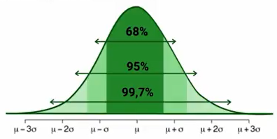
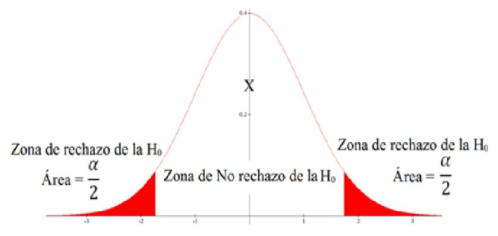

La medida de un **intervalo de confianza** (IC) nos indica un **rango de valores** dentro de los cuales se encuentran **valores significativos** de una población. En este rango de valore se tendrá limites confidentes, que son los valores de LI (Limite Inferior) y LS (Limite Superior).

Existen varios pares de números que representan distintos **niveles de confianza** $(1-\alpha)$, en cada uno de los intervalos de confianza nos indicaran cuales son las concentraciones de población entre estos pares de números. 

 

Como la distribución gaussiana es simétrica respecto a la media, entonces tendremos desviaciones tanto a la izquierda y derecha con las cuales podremos hallar estos intervalos de confianza.

Si decimos que nuestro intervalo debe tener un intervalo de confianza debe tener un indice de confianza del 95%, estamos siendo muy estrictos y pedimos que con 95% de certidumbre un valor se encuentre en un intervalo tomado.

Existen 3 valores mas usados a la hora de calcular un intervalo de confianza y son el 68%, el 95% y el 99.7% que generalmente se relacionan con los valores de $\mu+\sigma$, $\mu+2\sigma$ y $\mu+3\sigma$ respectivamente. Cuando es un estudio experimental generalmente se puede usar un indice de confianza del 68%, mientras que para un estudio mas serio, debemos ser mas estrictos y escoger valores de 95% y 99.7%.

Cuando trabajamos con datos, intentamos alcanzar una decisión en base a una hipótesis o conjeturas que se aplican a una población. Aquí usamos un concepto denominado **Hipótesis estadística**, y son **enunciados en base a las distribuciones de probabilidad** de las poblaciones, estas pueden ser **ciertas** o **falsas**.

## Nivel de Significación

El nivel de significactivo $\alpha$ sera el limite para juzgar si un resultado es o no es estadísticamente significativo. **Si el valor de significación es menor que el nivel de significación $(1-\alpha)$, el resultado es estadísticamente significativo**.

### Interpretación de resultado

En un ejemplo de edades de las personas que esquían, se interpreta que en un intervalo de confianza con un indice del 95% de certeza las edades de las personas que esquían están entre dos valores y aun así tenemos un 5% de probabilidad que sean otros valores.

**Contribución realizada por:** David Castillo
