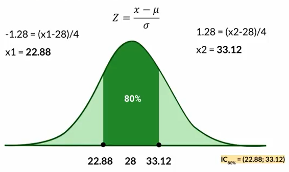

Para realizar el **cálculo del intervalo de confianza** de una distribución normal y encontrar los valores mínimo y máximo en un set de datos, podemos conocer tanto la media, desviación estándar y la varianza como también no conocer estos estadísticos descriptivos. 

## Cuando NO conocemos la información de la población.

Si deseamos saber cuales son los valores mínimo $-Z_{\alpha/2}$ y máximo $Z_{\alpha/2}$ para un indice de confianza del 95%, debemos recordar que en cada uno de los extremos de la distribución representaran 2.5%. Recuerda estamos modelando sobre una forma de distribución normal, es decir que es simétrica para una media población cero.

Nos ayudaremos para realizar el cálculo de estos limites con la tabla Z, usando el indice de confianza 95%, buscaremos el parámetro de tanto $P(X\leq z)= 0.95 + 0.025 = 0.975$, buscamos este valor en la tabla, donde en columna $z$ nos dará el valor numérico con su primer decimal, mientras que la fila $z$ nos dará el valor numérico de su segundo decimal.

De esta manera el numero con su primer decimal sera 1.9, mientras que el segundo decimal a seleccionar sera 0.06, de manera que el limite máximo sera $Z_{\alpha /2}= 1.96$, como estamos tratanto de una distribución normal, entonces es simetría respecto a una media cero, por cuanto $-Z_{\alpha /2}=-1.96$. Así nuestro Intervalo de confianza estará definido por:

$IC_{95\%}=(-1.96 ; 1.96)$

De esta manera lo menos que podemos seleccionar con un 95% de confianza es el -1.96, mientras que el valor máximo que podemos elegir es el 1.96. Pero recuerda que esta interpretación es cuando no tenemos conocimiento de los estadísticos descriptivos de nuestra distribución.

## Cuando SI sabemos información de la población.

Cuando ya tenemos los estadísticos descriptivos de nuestra población o muestra, como lo son la media, varianza, desviación estándar, podemos tener mas precisión acerca de nuestro modelo de investigación.

**Ejemplo._ La duración en días de un cepillo de dientes se ajusta a la distribución normal (28,4). Cual es el intervalo de confianza al 80%.**

Aqui sabemos que la media $\mu=28$ mientras que la varianza $\sigma^2=16$ y su desviación estándar sera $\sigma = 4$.

Ahora verificamos en la posición donde nuestro nivel de confianza sea el 80%, tendremos un $\alpha=20%$ o 0.2, por cuanto en cada extremo tendremos un 0.1 y el valor para encontrar el $Z_{\alpha/2}$ sera de un $P(X\leq z)= 0.8+0.1=0.9$ , por cuanto:

Como no existe un valor preciso en la tabla de 0.9, seleccionamos el mas cercano, en este caso sera 0.8997 y encontramos que nuestro valor de $Z_{\alpha /2}=1.28$, como es simétrico el limite mínimo sera $-Z_{\alpha/2}$. A través de este valor y el parámetro de normalización (formula):

$Z = \frac{x-\mu}{\sigma}$

De esta formula tenemos el parámetro de Z, por lo que debemos despejar el valor x:

$x = \sigma Z+\mu$

Reemplazando los limites serán:

$x_1 = (4)(-1.28)+28=22.88$

$x_2=(4)(1.28)+28=33.12$

Con estos valores hemos encontrado los valores de mínimo y máximo de nuestro intervalo de confianza:

$IC_{80\%}=(22.88 ; 33.12)$

La interpretación de este intervalo dirá que la duración mínima de un cepillo sera de 22.88 días, y la duración máxima sera del 33.12 días, esto con un nivel de confianza del 80%.

**Contribución realizada por:** David Castillo
