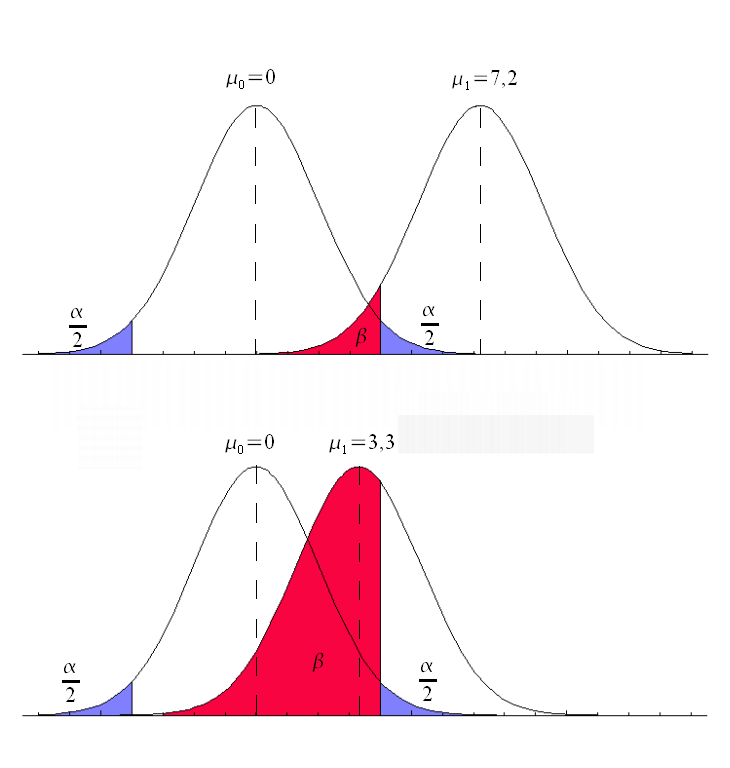

Ninguna prueba de hipótesis es cierta al 100%. Esto debido a que estamos tratando con probabilidades, por lo que puede existir la posibilidad de que una conclusión sea incorrecta. Cuando desarrollamos la prueba de hipótesis, podemos cometer dos tipos de errores, de **tipo I** y de **tipo II**. Estos tipos de errores también son llamados falsos positivos y falsos negativos correspondientemente.

Si recordamos como era el proceso de la prueba de hipótesis, se comenzaba sobre la hipótesis Nula. En un contexto, si la aceptábamos y sucede que efectivamente es verdadera, entonces estaremos en lo **correcto**. **Pero**, si la aceptamos y por cuestiones de la vida esta hipótesis es falsa, entonces estaríamos cometiendo un error de tipo I. Esto se debe a que cuando veíamos la significaría de un valor, este tenía una probabilidad de error en donde nuestra conclusión era falsa (Cálculo del valor-p, por lo general son valores pequeños).

Con este mismo sentido, si rechazamos la hipótesis Nula, y luego de un tiempo nos damos cuenta de que si fue verdadera, cometeríamos un error de tipo II.

La siguiente tabla resume las decisiones que podríamos tomar de acuerdo a la hipótesis Nula, y los tipos de errores que podríamos cometer de acuerdo a una probabilidad (α y β).

| Decisión sobre $H_0$ | Se acepta $H_0$            | Se rechaza $H_0$          |
| -------------------- | -------------------------- | ------------------------- |
| $H_0$ es verdadera   | Decisión Correcta          | Error de Tipo I (Error α) |
| $H_0$ es falsa       | Error de tipo II (Error β) | Decisión Correcta         |

## Error de tipo I

Se define como el **rechazo de la hipótesis nula** cuando esta es **en realidad es cierta.** También llamada falso positivo o error de tipo alfa, **siendo α la probabilidad de cometer un error de tipo I**.

## Error de tipo II

Se genera **cuando la hipótesis nula es falsa y no la rechazamos**. También conocida como falso negativo o error de tipo beta, **siendo β la probabilidad de cometer un error de tipo II**.

### Ejemplo Práctico:

Los ejemplos más escuchados se encuentran en la medicina, por ejemplo, si un sujeto padece de síntomas de una patología, y se realiza un test de sangre, puede existir dos hipótesis:

**Hipótesis Nula** $H_0:$ No padece la enfermedad.

**Hipótesis Alternativa** $H_1:$ Padece de la enfermedad.

Por cuanto tenemos los siguientes errores:

#### Error α

Me da la probabilidad de que el test sea positivo, y que el paciente tenga realmente la enfermedad. Pero en realidad está sano (Hipótesis Nula). Por lo llegamos a una conclusión de un **falso positivo**. 

¿Por qué salió este resultado? Esta probabilidad dependerá de la muestra tomada, y hay en veces que al realizar la muestra, no se procedió fielmente a un protocolo y se tomó mal la muestra, por lo que salió ese falso positivo.

#### Error β

Me da la probabilidad de que el test salga negativo, y que el paciente realmente este enfermo, llegando a un **falso negativo**.

Ambos tipos de errores para este ejemplo dependerán de muchos factores, desde que se tomó mal la muestra, errores de procedimiento, que el tubo de ensayo no es el adecuado, que hubo un patógeno que se introdujo sin ser visto, que la máquina analizadora se encuentra dañada, entre otros.

Lo importante es que para afianzar una hipótesis, usualmente se puede ejecutar una redundancia de muestras, es decir, tomar varias muestras y analizarlas cada una.

## Representación de tipos de errores

Una representación de las distribuciones y las zonas o regiones de estos tipos de errores podemos observarla en la siguiente imagen:

Si observamos es un tipo de prueba de hipótesis ANOVA, y además identificamos las distribuciones de acuerdo a una hipotética (modelo estándar) y la muestra obtenida.

Los tipos de errores se encontrarán en todo ámbito de muestreo y de test de hipótesis, entre sus aplicaciones se encuentra en:

- Control de calidad
- Software de Protección contra virus
- Imágenes médicas
- Detección de Objetos
- Detección de Bits en un enlace.

Y esta es una lista pequeña, los tipos de errores se moldearán a cualquier problema donde se encuentre el muestreo de datos.

**Contribución realizada por:** David Castillo