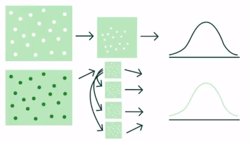

**Bootstraping es un método de remuestreo de datos** que se utilizara el muestreo aleatorio y se utiliza para aproximar la distribución de una variable en cuestión. Ahora tenemos que mencionar que para aplicar este remuestreo **se necesita muestras pequeñas o de muestras muy sesgadas**.

Un ejemplo para la aplicación del bootstraping seria el siguiente: Imagina que realizas un muestreo en una ciudad grande, como sabemos mientras mas muestras se tiene de un experimento, mas afinado se volvera nuestro modelo. Mientras que si realizamos un muestreo de una ciudad pequeña, entonces tendremos un sesgo mucho mayor, aqui se aplicaría la utilización del bootstraping.

## Funcionamiento de Bootstraping

Para aplicar el bootstraping partimos de una muestra, y de esta muestra volvemos a obtener una muestra (Algo asi como la muestra de la muestra). Si observamos el grafico, aqui se supone que la población es pequeña, en donde el primer ejemplo vemos que obtiene una muestra de la población y genera la distribución, pero como habiamos dicho antes, esta muestra es muy probable que se encuentre sesgada.

En el grafico de la parte inferior podemos observar que tomamos una muestra aleatoria y de esta tomamos otras 3 muestras adicionales. Y a partir de todas las muestras obtenemos una distribución resultante.

El procedimiento de bootstraping lo podemos realizar n veces, y se puede aplicar con al menos 25 registros y realizar el remuestreo unas 1000 veces.

**Contribución realizada por:** David Castillo
