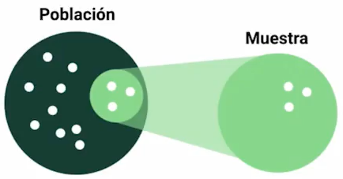
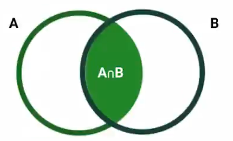

Los componentes principales de la estadística se dividen en:

1. Experimento
2. Población y Muestra
3. Eventos
4. Variables
5. Probabilidad de Ocurrencia

## 1. Experimento

El procedimiento de la experimentación puede ser realizada una vez, múltiples veces o infinitas veces, y a través de este podemos generar un conjunto de resultados posibles, a este conjunto se le denomina como **espacio muestral**.

El proceso de experimentación pueden arrojar el mismo resultado, como tambien puede arrojar un resultado distinto cada vez que se realice una iteración de un experimento.

Si el resultado del experimento es cambiante se trata de un resultado aleatorio, por ejemplo lanzar una moneda o lanzar un dado.

Si los resultados del experimento no cambian en cada iteración realizada, se trata de un exprimento determinista. Por ejemplo que lance una moneda y esta caiga al suelo, esto es de esperarse verdad.., por ello se denomina determinista.

Algunos ejemplos de experimentos serian:

Experimento Aleatorio:

- Tomar la medida de la temperatura de un cuarto en distintos meses.
- Numero de infectados al mes por un virus.
- Precio de divisas en la semana.

Experimento Determinista

- Cálculo entre el perimetro de cualquier circulo y su radio (número pi).
- Medida de la velocidad de la luz.

## 2. Población y Muestra

### Población

La población sera nuestro espacio completo de análisis, este sera un número grande. 

Por ejemplo._

1. El número de personas en una ciudad.
2. El número de animales de una especie en un lugar determinado.
3. El número de posibles clientes de una empresa.

### Muestra

La muestra es un subconjunto de una población.

Por ejemplo._

1. El número de habitantes de un barrio.
2. Un pequeño grupo o manada de animales de una especie en una area.
3. Un grupo de clientes mas cercanos alrededor de la ubicación de una empresa.

### Condiciones de extracción de resultados.

Las muestras de toman de acuerdo a un número significativo y representativo de la población como para deducir conclusiones.

Por Ejemplo._

De una población de un millón de personas si seleccionamos solo a 10 personas, es mas que probable que nuestras deducciones sean sesgadas y erróneas, ya que la muestra seleccionada no es lo suficientemente representativa de toda la población.

A esto se lellama **no ser estadisticamente significativo**.

Existen muchas formas y metodologías para que nuestras muestras sean significativas, uno de esos métodos es a través de un parámetro de nivel de confianza (1-α) que nos dará las conclusiones o hipotesis generadas de un estudio.

Una muestra puede obtenerse a través de calculadoras de tamaño de muestras, por ejemplo en este [enlace](https://www.questionpro.com/es/calculadora-de-muestra.html) te puedes encontrar una. Un ejemplo de uso de esta calculadora es el siguiente:

| Población | Nivel de Confianza (%) | Margen de Error (%) | Muestra a tomar |
|:---------:|:----------------------:|:-------------------:|:---------------:|
| 100       | 95                     | 5                   | 16370           |
| 1000      | 95                     | 5                   | 279             |
| 1000000   | 99                     | 1                   | 279             |

La selección de muestras tienen que ser analizada de acuerdo al caso de estudio, por ejemplo si deseamos analizar el comportamiento de gente joven, debemos subseccionar únicamente a los jóvenes de una población y agruparlos por edades.

Otro ejemplo, seria si deseamos estudiar los deportes, debemos observar todos los deportes, todos los géneros, zonas geográficas, etc. **Es importante que no nos sesguemos por una única preferencias, se debe observar a la muestra poblacional de acuerdo a un estudio  imparcial de los datos**.

Los estudios que suelen tener sesgos por preferencias suelen ser en época de elecciones, donde el estudio de las encuestas realizadas a una muestra son sesgadas por que solo se dirigió a un publico determinado, induciendo conclusiones sesgadas.

Por lo tanto es importante conocer la población  y el estudio de negocio en una muestra. Un ultimo ejemplo seria un estudio de gustos en Spotify, no únicamente se debe enviar las encuestas a las personas que escuchan rock, sino también a los que escuchan pop, rap, entre otros, ademas que no únicamente se debe enviar encuestas a los que escuchan mucho Spotify, sino que también se debe enviar a los que escuchan poco.

## 3 Evento

Un evento se refiere a los posibles resultados de un experimento, el conjunto de los eventos formaran también nuestro espacio muestral mencionado anteriormente.

## 4 Variables

Una variable tiene una característica donde esta puede obtener distintos valores. La naturaleza de una variable puede ser cualitativa y cuantitativa.

### Tipos de Variables

#### Variables Cualitativas

Son aquellas que nos dan una cualidad de un objeto/sujeto. Están pueden ser Nominales, Ordinales o Binarias.

**Nominales:** Son de comportamiento aislado y sus valores son mas separados de un dato matemático, por ejemplo el color: negro, blanco, rojo, azul, etc.

**Ordinales:** Son aquellas variables que tienen un comportamiento categórico, con tiene un numero limitado de valores, por ejemplo el estado civil puede ser soltero, casado, viudo.

**Binarios:** Este tipo de variable cualitativa solo puede tener dos posibles valores, también tienen un comportamiento categórico, un ejemplo seria genero donde solo podría tomar el valor de masculino y femenino.

#### Variables Cuantitativas

Son aquellas variables que tienen una característica numérica. Pueden ser discretas o continuas.

Por ejemplo._

**Discreta:** Edad, Numero de Hijos, Numero de Productos.
**Continua:** Temperatura, Altura, Precio.

## 5 Probabilidad de Ocurrencia

Este medirá el nivel de ocurrencia de un evento determinado. Por ejemplo la probabilidad de ocurrencia en el lanzamiento de una moneda donde  caiga cruz sera un 50% y que caiga cara sera un 50%.

**Así el análisis de eventos probabilisticos se denominara como estadística.**

### Probabilidad Condicional

Dado un evento ocurrido, la probabilidad condicional nos modela la probabilidad de que otro evento suceda consecutivamente. Es decir dado un evento B, la probabilidad de que ocurra el evento A sera de:

$P(A/B)=\frac{P(A∩B)}{P(B)}$

Ejemplo._

- Dado a que el día de hoy esta lloviendo, cual es la probabilidad de que llegue a la misma hora la oficina.

- Cual es la probabilidad de que si coma demasiado, luego me sienta mal.

Estas probabilidades son conjuntas, y plantean la sucesión de eventos uno tras otro por consecuencia de los mismo.
