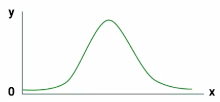
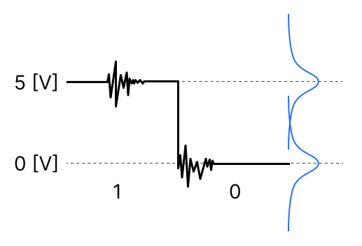

Luego de haber visto el estadístico principal de la población, vamos a ver cual es la población mas habitual. Y esta es que **la mayoría de los fenómenos que pasan en la naturaleza se pueden modelar a través de la distribución normal**.

Esta distribución se configura en los ejes xy y **tendrá la forma de campana**, donde la ocurrencia mas frecuente se encuentre concentrada en el centro de la campana. En los extremos de la campana se encontraran los valores atípicos o mas llamados "outliers" de un análisis, estos valores sera los poco usuales en el estudio.  

El nombre de distribución normal es debido a que se intenta concentrar la información mas frecuente al centro, y se quiere de alguna manera normalizar a todos los valores. Un valor recomendado de la concentración de información esta en el rango de $(\mu-3\sigma,\mu+3\sigma)$.

Otra característica de la distribución normal es que es **simétrica**, y los valores de los estadísticos descriptivos como **la media, la mediana y la moda son las mismas**.

$
media = mediana = moda
$

## Ejemplos

**1. Calorias ingeridas y peso**
De un grupo de personas si todos decidieran comer 200 calorías al día, la mayoría de  ellos se mantendrían en un peso similar, y se encontrarían al centro de la campana, pero existen casos en donde las personas tienen desordenes alimenticios.

Las personas que aumenten de peso mas que el peso promedio se encontraran a la derecha de la campana, mientras que las personas que pierdan peso y no estén en un peso similar a la mayoría se encontraran a la izquierda de la campana.

**2. Medición de la presión sanguínea**
Es sabido que por lo general la mayoría de las personas tenemos un rango similar de presión sanguínea, donde esa mayoría se encontrara al centro de la campana de la distribución, pero existe casos donde existen personas con hipertensión o hipotensión.

Las personas que tengan hipertensión tendrán una presión mas alta que el media y por cuanto se encontraran a la derecha de la campana de la distribución, ademas las personas que tengan hipotensión tendrán una presión mas baja de la normal y por cuanto se encontraran a la izquierda de la campana.

**3. Tamaño de los coches producidos por una maquina**
Cuando una fabrica realiza un producción de un número de productos, es posible que la mayoría tenga un tamaño similar, pero existen casos que el tamaño de unos cuantos productos varíen, y sean mas grandes o mas pequeños, estos productos se encontraran a los extremos de la campana de la distribución normal.

## Plus: Niveles de Voltaje en una transmisión de bits.

Otros fenómenos que se modelan a través de la distribución normal se encuentra en el mundo de las electrónica y en la transmisión de secuencias de bits, y es que sabemos que los bits son niveles de voltaje que representan desde una letra en un documento a una activación de un Led que se encuentra en la pantalla de nuestro computador.

Así para enviar un 1 de punto A a un punto B, podemos enviar una señal eléctrica de 5 volts,y si queremos enviar un 0, enviamos 0 volts. Pero sucede que entre el punto A y B pueden existir interferencias 🤯 y a nuestro punto B le puede llegar no 5 volts sino tal vez 5.6 volts o 4.5 volts.

Ahora si existe mucha interferencia puede que a nuestro punto B le llegue 7.6 volts o tal vez 2.4 volts, donde son valores poco usuales a la media de 5volts, es pues así que si llega un 7.6volts este valor se encontrara al lado derecho de la campana, mientras que el valor de 2.4volts se encontrara a la izquierda de la campana.

Contribución realizada por: David Castillo
