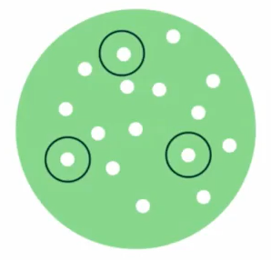
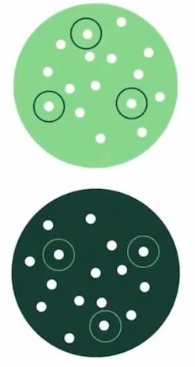

Las **muestras** es la extracción de un grupo significativo de la población, estas deben cumplir con dos requisitos importantes:

1. Que sea lo suficientemente grande para deducir una conclusión, de manera **que sea estadísticamente significativo**, aquí una [calculadora]([Calculadora de tamaño de muestra | QuestionPro](https://www.questionpro.com/es/calculadora-de-muestra.html)) para saber el tamaño de la muestra.

2. Que la muestra no este sesgada, es decir que debe cumplir con ciertos **atributos** que competan al estudio a realizar.

Estas dos condiciones aseguraran que las deducciones de nuestro estudio sean extrapolables a toda la población completa.

## Tipos de Muestreo

### Muestreo Aleatorio Simple

Aquí cada uno de las **muestras a seleccionar tienen la misma probabilidad de ser elegidas**. Un ejemplo seria la lotería, en donde todos los números tienen la misma probabilidad de ser elegidos como ganadores.

### Muestreo Sistemático

Es método de selección **sigue una regla definida por intervalos regulares**. Un ejemplo seria dar un premio por cada cien personas hasta llegar a los mil inscritos. Otro ejemplo definido por intervalos seria dar el premio de acuerdo a una hora determinada, por decir a la primera persona que envié un mensaje a las 05:00pm.

### Muestreo Estatificado

Este método **segmentara o subseccionara  a la población de acuerdo a un atributo en común y luego se seleccionara muestras aleatorias de cada uno de los segmentos**. Un ejemplo seria segmentar a una población de consumidores de un producto por edades, por ejemplo en jóvenes, adultos y personas de la tercera edad, y luego elegir un numero de personas por cada grupo y realizar el estudio con ellas.

## Teorema del limite central

Es una teoría estadística que enuncia que a medida que itera un experimento, la distribución de las medias de cada una de las muestras seleccionadas seguirá la forma de una distribución normal. 

Para ser mas precisos, el teorema de limite central describe las características de la población de las medias, en donde a medida que el numero de muestras crezca, la forma del conjunto de medias sera una distribución normal, independientemente de la distribución de cada muestra.

El siguiente [enlace](http://195.134.76.37/applets/AppletCentralLimit/Appl_CentralLimit2.html) es muy didáctico para comprender su funcionamiento, donde tendrás 8 diferentes distribuciones de muestras, que a medida que aumentamos el numero de muestras, la forma de las medias se asemejara a una distribución normal.

## Plus: Forma Matemática

Esta parte no es tan necesario para el curso, es un pequeño aporte de mi parte. Supongamos que en un experimento tenemos una muestra $X_1$ con 10 resultados distintos, esto quiere decir que la muestra esta formada por $X_1 = [x_1,x_2,...,x_{10}]$ , a esto se le llama variable aleatoria y tendrá un valor de media de $\mu_{X_1}$ y ademas su comportamiento estadístico estará configurada por alguna distribución (uniforme, binomial, gamma, etc).

Ahora supongamos que hacemos 50 iteraciones del experimento, esto quiere decir que tendremos 50 muestras, por lo que tendremos $X_1,X_2,...,X_{50}$ muestras, y cada una con sus propios resultados y sus propias medias $\mu_{X_1},\mu_{X_2},...,\mu_{X_{50}}$ . Ahora de este ultimo conjunto de medias, si las dibujáramos de acuerdo a una frecuencia de ocurrencia, obtendríamos muy probablemente la forma de campana que es la distribución gaussiana o normal. Esto es lo que nos quiere decir el teorema central del limite.
