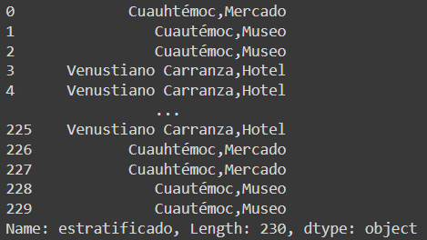
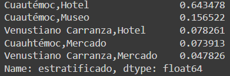

Para realizar el muestreo estratificado en Python usaremos unidades homogéneas exclusivas, es decir segmentar la población en grupos que tengan atributos en común de acuerdo al estudio que estemos realizando, luego de esto realizamos un 

## Segmentando nuestra Set de Datos

Para este caso de `econdata` podemos agrupar nuestro set de datos por los indices de `delegación` y `tipo`, concatenado los registros para generar un nuevo indice llamado `estratificado`.

```python
econdata['estratificado'] = econdata['delegacion']+","+econdata['tipo']
```



Realizo el conteo de los valores categóricos utilizando `.value_counts()` , obtengo sus proporciones y por ultimo las ordeno.

```python
(econdata['estratificado'].value_counts()/len(econdata)).sort_values(ascending=False)
```



### Selección de Registros para llegar a una proporción deseada.

Podemos tomar tantos registros de cada categoría para llegar a una proporción deseada, por ejemplo si queremos elegir que nuestro set de datos este configurado con un 50% de *Cuautémoc,Hotel*, un 20% de *Cuautémoc,Museo*, un 10% de *Venustiano Carranza,Hotel*, otro 10% de *Cuauhtémoc,Mercado* y por ultimo un 10% de *Venustiano Carranza,Mercado*.

Generamos una función para realizar la estratificación con estas proporciones, en esta función primero generamos un dataframe `df_estrat` de nuestra tabla, luego realizamos un barrido con cada uno de los valores categóricos `valores_estrat` para hallar una longitud de radio `ratio_len` para saber cual es la longitud del conjunto de registros de cada categoria para cumplir con la proporción deseada.

Luego filtramos los datos de acuerdo a la categoría y realizamos un muestreo aleatorio simple en los subconjuntos con `.sample`, por ultimo concatemos los dataframes de cada subconjunto categorico y retornamos el dataframe estratificado con proporciones dadas.

```python
def data_estratificada(econdata,nombres_columnas_estrat, valores_estrat, prop_estrat, random_state=None):
  df_estrat = pd.DataFrame(columns = econdata.columns)

  pos = -1
  for i in range(len(valores_estrat)):
    pos += 1
    if pos == len(valores_estrat) - 1:
      ratio_len = len(econdata) - len(df_estrat)
    else:
      ratio_len = int(len(econdata) * prop_estrat[i])
  
    df_filtrado = econdata[econdata[nombres_columnas_estrat] == valores_estrat[i]]
    df_temp = df_filtrado.sample(replace=True, n=ratio_len, random_state=random_state)
    
    df_estrat = pd.concat([df_estrat, df_temp])
  
  return df_estrat
```

Ahora generamos un dataframe para que se guarde los valores de la segmentación de acuerdo a una proporción dada. 

Para ello enviamos los parámetros del set de datos `econdata`, el nombre de la columna con datos categóricos `estratificado`, los valores de estratificación  `valores_estrat`, las proporciones correspondientes `prop_estrat` y por ultimo un parámetro de selección de estado aleatorio `random_state`.

El parámetro `radom_estate` es un estado para que obtengamos las mismas selecciones de registros si nos encontramos trabajando con algún equipo.

```python
valores_estrat = ['Cuautémoc,Hotel', 'Cuautémoc,Museo', 'Venustiano Carranza,Hotel', 'Cuauhtémoc,Mercado','Venustiano Carranza,Mercado']
prop_estrat = [0.5, 0.2, 0.1, 0.1, 0.1]
df_estrat = data_estratificada(econdata, 'estratificado', valores_estrat, prop_estrat, random_state=42)
df_estrat
```

Consejo: Los valores categóricos son cualitativos, por lo que pueden ser Nominales o Binarios, debemos escribir y realizar una correcta tipificación de los mismos al momento de filtrar y estratificar para no obtener errores o registros errados.

**Contribución realizada por:** David Castillo
