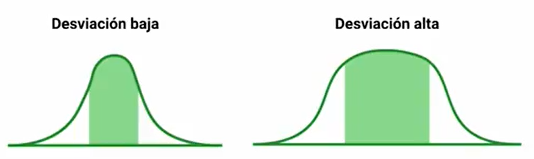
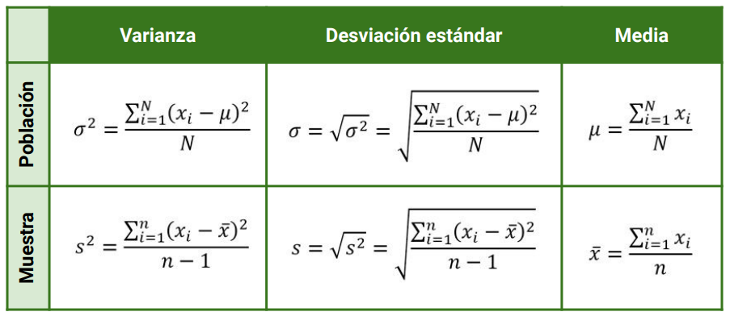

Tanto la **varianza** como la **desviación estándar** nos indica la **dispersión** de los datos con respecto a la media. Los dos parámetros se encuentran relacionadas entre si, de esta manera que **la desviación estándar es la raíz cuadrada de la varianza**. 

$desviación \ estandar = \sqrt{variación}$

$\sigma = \sqrt{\sigma^2}$

A partir de una distribución normal, podemos inferir que si sus datos se encuentran concentrados alrededor de la media, la desviación y la varianza serán pequeñas. De igual manera para si los datos de la distribución se encuentran alejados de la media, se puede deducir que tanto la desviación como la varianza serán grandes.

Un ejemplo seria en las edades en una población en una ciudad, si de una muestra sus edades se encuentran entre los 10 y 30 años, entonces la desviación sera baja, pero si de otra muestra de personas se encuentran edades de 10  a 90 años nos esperamos una desviación mucho mayor.

## Cálculo de la varianza y desviación estándar

A partir de la desviación estándar, el termino estándar se refiere a una **normalización**, y por ello la raíz cuadrada a la variación. Y se tiene una desviación estándar tanto **muestral** como **poblacional**, y ambas se calculan de manera diferente. Como vimos anteriormente, los símbolos para la media muestral era la $\bar{X}$, mientras que para la media poblacional era $\mu$. Ahora los símbolos para la **deviación estándar muestral** sera $s$, mientras que para la desviación estándar poblacional sera $\sigma$. Un resumen de las formulas para los parámetros son los siguientes:

- **Ejemplo:** Si tenemos una muestra de personas con edades de 28, 24, 25, 23, 38 y 52, tendremos una media muestral de 31.7 años. A partir de esta realizamos el calculo de la varianza muestral en donde:
  
  $s=\sqrt{\frac{(28-31.7)^2+(24-31.7)^2+(25-31.7)^2+(23-31.7)^2+(38-31.7)^2+(58-31.7)^2}{6-1}}=14.14$
  
  $s^2=200.12$
  
  El resultado de la desviación estándar sera 14.14 y la varianza sera 200.12

## Resultados del Reto

**a) Calcula la varianza y desviación estándar de la siguiente población de datos:**

`7, 10, 12, 13, 16, 9, 8, 12, 8, 6,
16, 23, 11, 17, 20, 21, 25, 30, 31
33, 37, 39, 27, 36, 40, 43, 41, 45`

$\mu=\frac{7+10+12+13+16+9+8+12+8+6+16+23+11+17+20+21+25+30+31+33+37+39+27+36+40+43+41+45}{28}=22.71$

$\sigma=\sqrt{\frac{\sum_{i=1}^{28}(x_i-\mu)}{28}}=12.45$

$\sigma^2=155.06$

**b) Toma una muestra de los datos y calcula la varianza y desviación estándar muestral de la misma población de datos:**

Si realizamos un muestreo aleatorio simple con 10 elementos, obteniendo:

$X=\{12,39,9,12,17,33,23,11,10,27\}$

$\bar{X}=\frac{12+39+9+12+17+33+23+11+10+27}{10}=19.3$

$s=\sqrt{\frac{\sum_{i=1}^{9}(x_i-\bar{X})}{9}}=12.68$

$s^2=160.80$

El calculo se puede soportar por el siguiente código realizado en [Colab](https://colab.research.google.com/drive/1tpFSyKSjzfdxW50xntg4lPqqjZHJMf-x?usp=sharing).

**Contribución realizada por:** David Castillo
