Los componentes principales de la estadística se dividen en:

1. Experimento
2. Población y Muestra
3. Eventos
4. Variables
5. Probabilidad de Ocurrencia

## 1. Experimento

El procedimiento de la experimentación puede ser realizada una vez, múltiples veces o infinitas veces, y a través de este podemos generar un conjunto de resultados posibles, a este conjunto se le denomina como **espacio muestral**.

El proceso de experimentación pueden arrojar el mismo resultado, como tambien puede arrojar un resultado distinto cada vez que se realice una iteración de un experimento.

Si el resultado del experimento es cambiante se trata de un resultado aleatorio, por ejemplo lanzar una moneda o lanzar un dado.

Si los resultados del experimento no cambian en cada iteración realizada, se trata de un exprimento determinista. Por ejemplo que lance una moneda y esta caiga al suelo, esto es de esperarse verdad.., por ello se denomina determinista.

Algunos ejemplos de experimentos serian:

Experimento Aleatorio:

- Tomar la medida de la temperatura de un cuarto en distintos meses.
- Numero de infectados al mes por un virus.
- Precio de divisas en la semana.

Experimento Determinista

- Cálculo entre el perimetro de cualquier circulo y su radio (número pi).
- Medida de la velocidad de la luz.

## 2. Población y Muestra

### Población

La población sera nuestro espacio completo de análisis, este sera un número grande. 

Por ejemplo._

1. El número de personas en una ciudad.
2. El número de animales de una especie en un lugar determinado.
3. El número de posibles clientes de una empresa.

### Muestra

La muestra es un subconjunto de una población.


Por ejemplo._

1. El número de habitantes de un barrio.
2. Un pequeño grupo o manada de animales de una especie en una area.
3. Un grupo de clientes mas cercanos alrededor de la ubicación de una empresa.

### Condiciones de extracción de resultados.

Las muestras de toman de acuerdo a un número significativo y representativo de la población como para deducir conclusiones.

Por Ejemplo._

De una población de un millón de personas si seleccionamos solo a 10 personas, es mas que probable que nuestras deducciones sean sesgadas y erróneas, ya que la muestra seleccionada no es lo suficientemente representativa de toda la población.

A esto se lellama **no ser estadisticamente significativo**.

Existen muchas formas y metodologías para que nuestras muestras sean significativas, uno de esos métodos es a través de un parámetro de nivel de confianza (1-α) que nos dará las conclusiones o hipotesis generadas de un estudio.

Una muestra puede obtenerse a través de calculadoras de tamaño de muestras, por ejemplo en este [enlace](https://www.questionpro.com/es/calculadora-de-muestra.html) te puedes encontrar una. Un ejemplo de uso de esta calculadora es el siguiente:

| Población | Nivel de Confianza (%) | Margen de Error (%) | Muestra a tomar |
|:---------:|:----------------------:|:-------------------:|:---------------:|
| 100       | 95                     | 5                   | 16370           |
| 1000      | 95                     | 5                   | 279             |
| 1000000   | 99                     | 1                   | 279             |

La selección de muestras tienen que ser analizada de acuerdo al caso de estudio, por ejemplo si deseamos analizar el comportamiento de gente joven, debemos subseccionar únicamente a los jóvenes de una población y agruparlos por edades.

Otro ejemplo, seria si deseamos estudiar los deportes, debemos observar todos los deportes, todos los géneros, zonas geográficas, etc. **Es importante que no nos sesguemos por una única preferencias, se debe observar a la muestra poblacional de acuerdo a un estudio  imparcial de los datos**.

Los estudios que suelen tener sesgos por preferencias suelen ser en época de elecciones, donde el estudio de las encuestas realizadas a una muestra son sesgadas por que solo se dirigió a un publico determinado, induciendo conclusiones sesgadas.

Por lo tanto es importante conocer la población  y el estudio de negocio en una muestra. Un ultimo ejemplo seria un estudio de gustos en Spotify, no únicamente se debe enviar las encuestas a las personas que escuchan rock, sino también a los que escuchan pop, rap, entre otros, ademas que no únicamente se debe enviar encuestas a los que escuchan mucho Spotify, sino que también se debe enviar a los que escuchan poco.

## 3 Evento

Un evento se refiere a los posibles resultados de un experimento, el conjunto de los eventos formaran también nuestro espacio muestral mencionado anteriormente.

## 4 Variables

Una variable tiene una característica donde esta puede obtener distintos valores. La naturaleza de una variable puede ser cualitativa y cuantitativa.

### Tipos de Variables

#### Variables Cualitativas

Son aquellas que nos dan una cualidad de un objeto/sujeto. Están pueden ser Nominales, Ordinales o Binarias.

**Nominales:** Son de comportamiento aislado y sus valores son mas separados de un dato matemático, por ejemplo el color: negro, blanco, rojo, azul, etc.

**Ordinales:** Son aquellas variables que tienen un comportamiento categórico, con tiene un numero limitado de valores, por ejemplo el estado civil puede ser soltero, casado, viudo.

**Binarios:** Este tipo de variable cualitativa solo puede tener dos posibles valores, también tienen un comportamiento categórico, un ejemplo seria genero donde solo podría tomar el valor de masculino y femenino.

#### Variables Cuantitativas

Son aquellas variables que tienen una característica numérica. Pueden ser discretas o continuas.

Por ejemplo._

**Discreta:** Edad, Numero de Hijos, Numero de Productos.
**Continua:** Temperatura, Altura, Precio.

## 5 Probabilidad de Ocurrencia

Este medirá el nivel de ocurrencia de un evento determinado. Por ejemplo la probabilidad de ocurrencia en el lanzamiento de una moneda donde  caiga cruz sera un 50% y que caiga cara sera un 50%.

**Así el análisis de eventos probabilisticos se denominara como estadística.**

### Probabilidad Condicional

Dado un evento ocurrido, la probabilidad condicional nos modela la probabilidad de que otro evento suceda consecutivamente. Es decir dado un evento B, la probabilidad de que ocurra el evento A sera de:


$P(A/B)=\frac{P(A∩B)}{P(B)}$


Ejemplo._

- Dado a que el día de hoy esta lloviendo, cual es la probabilidad de que llegue a la misma hora la oficina.

- Cual es la probabilidad de que si coma demasiado, luego me sienta mal.

Estas probabilidades son conjuntas, y plantean la sucesión de eventos uno tras otro por consecuencia de los mismo.
Las **muestras** es la extracción de un grupo significativo de la población, estas deben cumplir con dos requisitos importantes:

1. Que sea lo suficientemente grande para deducir una conclusión, de manera **que sea estadísticamente significativo**, aquí una [calculadora]([Calculadora de tamaño de muestra | QuestionPro](https://www.questionpro.com/es/calculadora-de-muestra.html)) para saber el tamaño de la muestra.

2. Que la muestra no este sesgada, es decir que debe cumplir con ciertos **atributos** que competan al estudio a realizar.

Estas dos condiciones aseguraran que las deducciones de nuestro estudio sean extrapolables a toda la población completa.

## Tipos de Muestreo

### Muestreo Aleatorio Simple


Aquí cada uno de las **muestras a seleccionar tienen la misma probabilidad de ser elegidas**. Un ejemplo seria la lotería, en donde todos los números tienen la misma probabilidad de ser elegidos como ganadores.

### Muestreo Sistemático

Es método de selección **sigue una regla definida por intervalos regulares**. Un ejemplo seria dar un premio por cada cien personas hasta llegar a los mil inscritos. Otro ejemplo definido por intervalos seria dar el premio de acuerdo a una hora determinada, por decir a la primera persona que envié un mensaje a las 05:00pm.

### Muestreo Estatificado


Este método **segmentara o subseccionara  a la población de acuerdo a un atributo en común y luego se seleccionara muestras aleatorias de cada uno de los segmentos**. Un ejemplo seria segmentar a una población de consumidores de un producto por edades, por ejemplo en jóvenes, adultos y personas de la tercera edad, y luego elegir un numero de personas por cada grupo y realizar el estudio con ellas.

## Teorema del limite central

Es una teoría estadística que enuncia que a medida que itera un experimento, la distribución de las medias de cada una de las muestras seleccionadas seguirá la forma de una distribución normal. 

Para ser mas precisos, el teorema de limite central describe las características de la población de las medias, en donde a medida que el numero de muestras crezca, la forma del conjunto de medias sera una distribución normal, independientemente de la distribución de cada muestra.

El siguiente [enlace](http://195.134.76.37/applets/AppletCentralLimit/Appl_CentralLimit2.html) es muy didáctico para comprender su funcionamiento, donde tendrás 8 diferentes distribuciones de muestras, que a medida que aumentamos el numero de muestras, la forma de las medias se asemejara a una distribución normal.

## Plus: Forma Matemática

Esta parte no es tan necesario para el curso, es un pequeño aporte de mi parte. Supongamos que en un experimento tenemos una muestra $X_1$ con 10 resultados distintos, esto quiere decir que la muestra esta formada por $X_1 = [x_1,x_2,...,x_{10}]$ , a esto se le llama variable aleatoria y tendrá un valor de media de $\mu_{X_1}$ y ademas su comportamiento estadístico estará configurada por alguna distribución (uniforme, binomial, gamma, etc).

Ahora supongamos que hacemos 50 iteraciones del experimento, esto quiere decir que tendremos 50 muestras, por lo que tendremos $X_1,X_2,...,X_{50}$ muestras, y cada una con sus propios resultados y sus propias medias $\mu_{X_1},\mu_{X_2},...,\mu_{X_{50}}$ . Ahora de este ultimo conjunto de medias, si las dibujáramos de acuerdo a una frecuencia de ocurrencia, obtendríamos muy probablemente la forma de campana que es la distribución gaussiana o normal. Esto es lo que nos quiere decir el teorema central del limite.
Luego de haber visto el estadístico principal de la población, vamos a ver cual es la población mas habitual. Y esta es que **la mayoría de los fenómenos que pasan en la naturaleza se pueden modelar a través de la distribución normal**.

Esta distribución se configura en los ejes xy y **tendrá la forma de campana**, donde la ocurrencia mas frecuente se encuentre concentrada en el centro de la campana. En los extremos de la campana se encontraran los valores atípicos o mas llamados "outliers" de un análisis, estos valores sera los poco usuales en el estudio.  

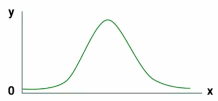

El nombre de distribución normal es debido a que se intenta concentrar la información mas frecuente al centro, y se quiere de alguna manera normalizar a todos los valores. Un valor recomendado de la concentración de información esta en el rango de $(\mu-3\sigma,\mu+3\sigma)$.

Otra característica de la distribución normal es que es **simétrica**, y los valores de los estadísticos descriptivos como **la media, la mediana y la moda son las mismas**.

$
media = mediana = moda
$

## Ejemplos

**1. Calorias ingeridas y peso**
De un grupo de personas si todos decidieran comer 200 calorías al día, la mayoría de  ellos se mantendrían en un peso similar, y se encontrarían al centro de la campana, pero existen casos en donde las personas tienen desordenes alimenticios.

Las personas que aumenten de peso mas que el peso promedio se encontraran a la derecha de la campana, mientras que las personas que pierdan peso y no estén en un peso similar a la mayoría se encontraran a la izquierda de la campana.

**2. Medición de la presión sanguínea**
Es sabido que por lo general la mayoría de las personas tenemos un rango similar de presión sanguínea, donde esa mayoría se encontrara al centro de la campana de la distribución, pero existe casos donde existen personas con hipertensión o hipotensión.

Las personas que tengan hipertensión tendrán una presión mas alta que el media y por cuanto se encontraran a la derecha de la campana de la distribución, ademas las personas que tengan hipotensión tendrán una presión mas baja de la normal y por cuanto se encontraran a la izquierda de la campana.

**3. Tamaño de los coches producidos por una maquina**
Cuando una fabrica realiza un producción de un número de productos, es posible que la mayoría tenga un tamaño similar, pero existen casos que el tamaño de unos cuantos productos varíen, y sean mas grandes o mas pequeños, estos productos se encontraran a los extremos de la campana de la distribución normal.

## Plus: Niveles de Voltaje en una transmisión de bits.

Otros fenómenos que se modelan a través de la distribución normal se encuentra en el mundo de las electrónica y en la transmisión de secuencias de bits, y es que sabemos que los bits son niveles de voltaje que representan desde una letra en un documento a una activación de un Led que se encuentra en la pantalla de nuestro computador.

Así para enviar un 1 de punto A a un punto B, podemos enviar una señal eléctrica de 5 volts,y si queremos enviar un 0, enviamos 0 volts. Pero sucede que entre el punto A y B pueden existir interferencias 🤯 y a nuestro punto B le puede llegar no 5 volts sino tal vez 5.6 volts o 4.5 volts.

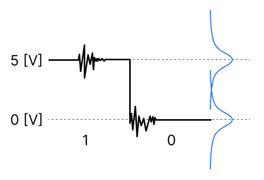

Ahora si existe mucha interferencia puede que a nuestro punto B le llegue 7.6 volts o tal vez 2.4 volts, donde son valores poco usuales a la media de 5volts, es pues así que si llega un 7.6volts este valor se encontrara al lado derecho de la campana, mientras que el valor de 2.4volts se encontrara a la izquierda de la campana.

Contribución realizada por: David Castillo
Para codificar las tres funciones de muestreo (Aleatorio Simple, Sistemático y Estratificado) en Python usaremos cuadernos de codificación, el que se usara sera Colab, aunque también se puede utilizar Jupiter Notebook o DeepNote.

Se recomienda Google Colab o DeepNote porque en ellas no es necesario instalar las librerías que se van a utilizar.

## Librerias a utilizar

Las librerías a utilizar serán pandas, numpy, random para generar números aleatorios y io para convertir nuestro documento csv en un objeto binario.

```python
import pandas as pd
import numpy  as np
import random
import io
```

Luego descargamos la set de datos de `econdata.csv` que podemos descargarlo en este [enlace](https://static.platzi.com/media/public/uploads/econdata_ea911019-5acc-4c3e-94c1-4bae1896d167.csv). Este set de datos procederemos a cargarla en nuestro Google Colab. A través del método `upload`.

```python
from google.colab import files
uploaded = files.upload()
```

Hacemos uso del método `BytesIO` del modulo `io` para codificar nuestro documento *Econdata.csv* en un objeto binario (Si deseas saber mas sobre los objetos binarios, te dejo el siguiente [enlace](https://docs.python.org/3/glossary.html#term-bytes-like-object)). Despues leemos este este archivo codificado en objeto binario a través del método de `read_csv` y lo trataremos como un **dataframe** con el modulo de `pandas`.

Si observamos cuantos registros existen en este dataframe, nos vamos a encontrar que tiene 230 registros. Mostramos los primeros 5 registros del datafame `econdata` a través del método `head()`.

```python
econdata = pd.read_csv(io.BytesIO(uploaded["Econdata.csv"]))
# Los 5 primeros registros
econdata.head()
```


## Muestreo Aleatorio Simple

Para realizar el muestreo aleatorio simple hacemos uso del método `sample` del modulo `pandas`, recordemos que convertimos nuestro archivo en un dataframe. Por cuanto al aplicar el método `sample(n=8)` seleccionaremos 8 registros aleatorios del dataframe. Por si te da curiosidad, te dejo la documentación del método `sample` en este [enlace](https://pandas.pydata.org/docs/reference/api/pandas.DataFrame.sample.html).

```python
aleat_8 = econdata.sample(n=8)
aleat_8
```


Cada momento que ejecutemos esta linea se seleccionara 8 registros distintos del dataframe.

Ahora podemos escoger un grupo de registros de acuerdo a una fracción de este, recordemos que nuestro dataframe tiene 230 registros, si queremos seleccionar un 25% de todos registros y que se seleccionen de manera aleatoria, insertamos el atributo `frac=0.25` dentro del método `.sample()`. En este caso nos lanzara un dataframe de $250*0.25=57.5\approx58$ registros que lo nombraremos `prop_25`.

```python
prop_25 = econdata.sample(frac=.25)
print('Dataframe de longitud de '+str(len(prop_25)))
prop_25.head()
```


## Muestreo Sistemático

Recordemos que el muestreo sistemático se selecciona a través de un intervalo, definimos una función con parámetros `econdata,step`, pasamos el dataframe con el parámetro `econdata` y seleccionaremos las posiciones de los registros con el parámetro de `step`. Por ejemplo si seleccionamos un `step=3`, tendremos los siguientes registros con posiciones:

$econdata[0]$
$econdata[3]$
$econdata[6]$
...
$econdata[225]$
$econdata[228]$

Generamos un dataframe `systematic_sample` donde seleccionaremos los registros de `econdata` con las posiciones seleccionadas en `step`, devolvemos este dataframe con las muestras realizadas sistemáticas.

```python
def systematic_sampling(econdata,step):
  indexes = np.arange(0,len(econdata),step=step)
  systematic_sample = econdata.iloc[indexes]
  return systematic_sample

systematic_sample = systematic_sampling(econdata, 3)
systematic_sample.head()
```


Para realizar el muestreo estratificado en Python usaremos unidades homogéneas exclusivas, es decir segmentar la población en grupos que tengan atributos en común de acuerdo al estudio que estemos realizando, luego de esto realizamos un 

## Segmentando nuestra Set de Datos

Para este caso de `econdata` podemos agrupar nuestro set de datos por los indices de `delegación` y `tipo`, concatenado los registros para generar un nuevo indice llamado `estratificado`.

```python
econdata['estratificado'] = econdata['delegacion']+","+econdata['tipo']
```

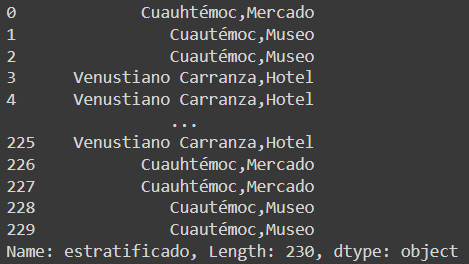

Realizo el conteo de los valores categóricos utilizando `.value_counts()` , obtengo sus proporciones y por ultimo las ordeno.

```python
(econdata['estratificado'].value_counts()/len(econdata)).sort_values(ascending=False)
```

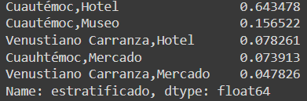

### Selección de Registros para llegar a una proporción deseada.

Podemos tomar tantos registros de cada categoría para llegar a una proporción deseada, por ejemplo si queremos elegir que nuestro set de datos este configurado con un 50% de *Cuautémoc,Hotel*, un 20% de *Cuautémoc,Museo*, un 10% de *Venustiano Carranza,Hotel*, otro 10% de *Cuauhtémoc,Mercado* y por ultimo un 10% de *Venustiano Carranza,Mercado*.

Generamos una función para realizar la estratificación con estas proporciones, en esta función primero generamos un dataframe `df_estrat` de nuestra tabla, luego realizamos un barrido con cada uno de los valores categóricos `valores_estrat` para hallar una longitud de radio `ratio_len` para saber cual es la longitud del conjunto de registros de cada categoria para cumplir con la proporción deseada.

Luego filtramos los datos de acuerdo a la categoría y realizamos un muestreo aleatorio simple en los subconjuntos con `.sample`, por ultimo concatemos los dataframes de cada subconjunto categorico y retornamos el dataframe estratificado con proporciones dadas.

```python
def data_estratificada(econdata,nombres_columnas_estrat, valores_estrat, prop_estrat, random_state=None):
  df_estrat = pd.DataFrame(columns = econdata.columns)

  pos = -1
  for i in range(len(valores_estrat)):
    pos += 1
    if pos == len(valores_estrat) - 1:
      ratio_len = len(econdata) - len(df_estrat)
    else:
      ratio_len = int(len(econdata) * prop_estrat[i])
  
    df_filtrado = econdata[econdata[nombres_columnas_estrat] == valores_estrat[i]]
    df_temp = df_filtrado.sample(replace=True, n=ratio_len, random_state=random_state)
    
    df_estrat = pd.concat([df_estrat, df_temp])
  
  return df_estrat
```

Ahora generamos un dataframe para que se guarde los valores de la segmentación de acuerdo a una proporción dada. 

Para ello enviamos los parámetros del set de datos `econdata`, el nombre de la columna con datos categóricos `estratificado`, los valores de estratificación  `valores_estrat`, las proporciones correspondientes `prop_estrat` y por ultimo un parámetro de selección de estado aleatorio `random_state`.

El parámetro `radom_estate` es un estado para que obtengamos las mismas selecciones de registros si nos encontramos trabajando con algún equipo.

```python
valores_estrat = ['Cuautémoc,Hotel', 'Cuautémoc,Museo', 'Venustiano Carranza,Hotel', 'Cuauhtémoc,Mercado','Venustiano Carranza,Mercado']
prop_estrat = [0.5, 0.2, 0.1, 0.1, 0.1]
df_estrat = data_estratificada(econdata, 'estratificado', valores_estrat, prop_estrat, random_state=42)
df_estrat
```

Consejo: Los valores categóricos son cualitativos, por lo que pueden ser Nominales o Binarios, debemos escribir y realizar una correcta tipificación de los mismos al momento de filtrar y estratificar para no obtener errores o registros errados.

**Contribución realizada por:** David Castillo
Para comprender de mejor manera cual es la **media muestral** tenemos que reforzar los conceptos de **media, la moda y la mediana**.

## Que es la Media?

La **media** es la suma de todos las observaciones dividida por el numero total de observaciones, es decir $\bar{X} = \frac{1}{N}\sum_{i=1}^{N}x_i$.


Por ejemplo si deseas saber el promedio de calificaciones, donde tuviste 3 pruebas con calificaciones de 7, 8 y 9, entonces el media seria realizar $(7+8+9)/3=8$. 

La media podemos utilizarla en muchos contextos, por ejemplo la media de la duración de las canciones que escuchas.

## Que es la Moda?

La **moda** sera el dato que mas veces se repite en un experimento, por ejemplo si realizas una encuesta en una universidad y te encuentras con que haz encuestado a 15 personas de 20 años y a 10 personas de 21 años, eso quiere decir que la moda es personas de 20 años.

## Que es la Mediana?

Es el dato que se encuentra en el centro de todos. Es decir que encontraremos el dato que se encuentre en la mitad de todo el conjunto de datos resultantes. Un ejemplo seria si tengo un conjunto de datos de $\{1,2,3,4,5\}$, aquí la mediana sera el numero 3. Existen dos formulas para el calculo de la mediana de acuerdo al numero de observaciones, si es un numero par o impar.

$x_{(N+1)/2}$, si N es impar

$\frac{1}{2}(x_{N/2}+x_{N/2+1})$, si N es par 


## Que es la Media Muestral?

La media muestral es también llamada media aritmética, promedio o simplemente media, y se trata de sumar todos los valores de un conjunto cuantitativo y dividirlo para numero total de los valores que existan.

Hay que mencionar que la **media muestral** $\bar{X}$ es distinta a la **media poblacional** $\mu$, recuerda el concepto de **muestreo** significa una extracción de toda la población. Por ello tomamos una muestra de la población y de esta obtenemos su media.

### Calculo de la varianza y desviación estándar.

Para el calculo de desviación estándar muestral utilizamos.

$s=\sqrt{s^2}=\sqrt{\frac{\sum_{i=1}^{n}(x_i-\bar{x})^2}{n-1}} $

Para el calculo de la desviación estándar poblacional, se utiliza:

$\sigma=\sqrt{\sigma^2}=\sqrt{\frac{\sum_{i=1}^{N}(x_i-\mu)^2}{N}}$

**Contribución realizada por:** David Castillo

Tanto la **varianza** como la **desviación estándar** nos indica la **dispersión** de los datos con respecto a la media. Los dos parámetros se encuentran relacionadas entre si, de esta manera que **la desviación estándar es la raíz cuadrada de la varianza**. 

$desviación \ estandar = \sqrt{variación}$

$\sigma = \sqrt{\sigma^2}$

A partir de una distribución normal, podemos inferir que si sus datos se encuentran concentrados alrededor de la media, la desviación y la varianza serán pequeñas. De igual manera para si los datos de la distribución se encuentran alejados de la media, se puede deducir que tanto la desviación como la varianza serán grandes.

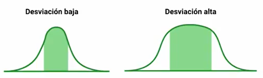

Un ejemplo seria en las edades en una población en una ciudad, si de una muestra sus edades se encuentran entre los 10 y 30 años, entonces la desviación sera baja, pero si de otra muestra de personas se encuentran edades de 10  a 90 años nos esperamos una desviación mucho mayor.

## Cálculo de la varianza y desviación estándar

A partir de la desviación estándar, el termino estándar se refiere a una **normalización**, y por ello la raíz cuadrada a la variación. Y se tiene una desviación estándar tanto **muestral** como **poblacional**, y ambas se calculan de manera diferente. Como vimos anteriormente, los símbolos para la media muestral era la $\bar{X}$, mientras que para la media poblacional era $\mu$. Ahora los símbolos para la **deviación estándar muestral** sera $s$, mientras que para la desviación estándar poblacional sera $\sigma$. Un resumen de las formulas para los parámetros son los siguientes:

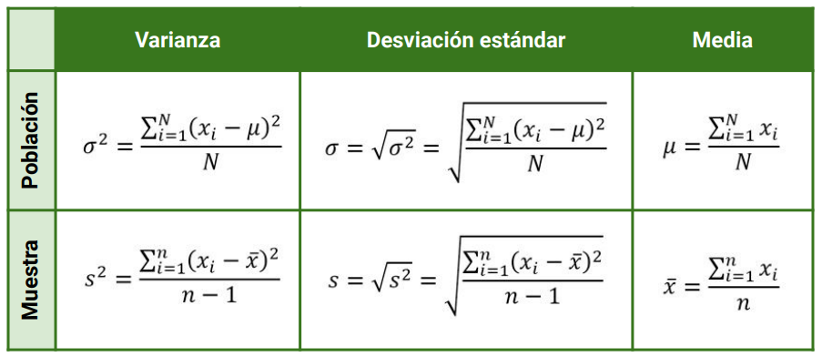

- **Ejemplo:** Si tenemos una muestra de personas con edades de 28, 24, 25, 23, 38 y 52, tendremos una media muestral de 31.7 años. A partir de esta realizamos el calculo de la varianza muestral en donde:
  
  $s=\sqrt{\frac{(28-31.7)^2+(24-31.7)^2+(25-31.7)^2+(23-31.7)^2+(38-31.7)^2+(58-31.7)^2}{6-1}}=14.14$
  
  $s^2=200.12$
  
  El resultado de la desviación estándar sera 14.14 y la varianza sera 200.12

## Resultados del Reto

**a) Calcula la varianza y desviación estándar de la siguiente población de datos:**

`7, 10, 12, 13, 16, 9, 8, 12, 8, 6,
16, 23, 11, 17, 20, 21, 25, 30, 31
33, 37, 39, 27, 36, 40, 43, 41, 45`

$\mu=\frac{7+10+12+13+16+9+8+12+8+6+16+23+11+17+20+21+25+30+31+33+37+39+27+36+40+43+41+45}{28}=22.71$

$\sigma=\sqrt{\frac{\sum_{i=1}^{28}(x_i-\mu)}{28}}=12.45$

$\sigma^2=155.06$

**b) Toma una muestra de los datos y calcula la varianza y desviación estándar muestral de la misma población de datos:**

Si realizamos un muestreo aleatorio simple con 10 elementos, obteniendo:

$X=\{12,39,9,12,17,33,23,11,10,27\}$

$\bar{X}=\frac{12+39+9+12+17+33+23+11+10+27}{10}=19.3$

$s=\sqrt{\frac{\sum_{i=1}^{9}(x_i-\bar{X})}{9}}=12.68$

$s^2=160.80$

El calculo se puede soportar por el siguiente código realizado en [Colab](https://colab.research.google.com/drive/1tpFSyKSjzfdxW50xntg4lPqqjZHJMf-x?usp=sharing).

**Contribución realizada por:** David Castillo
Para realizar el calculo de la varianza, desviación estándar y media tanto muestrales como poblacionales en Python, utilizaremos el cuaderno de Código de Google Colab. Llamaremos a las librerías necesarias como pandas, numpy, matplotlib y seaborn.

```python
import pandas as pd
import numpy as np
import matplotlib.pyplot as plt
import seaborn as sns
```

Luego cargaremos un set de datos muy conocido en el mundo de la ciencia de datos, que tiene nombre `iris`. Hacemos uso de la librería de pandas y su método de lectura de documentos CSV `pd.read_csv()`.

```python
url = 'https://archive.ics.uci.edu/ml/machine-learning-databases/iris/iris.data'
names = ['sepal-length','sepal-width','petal-length','petal-width','class']
iris = pd.read_csv(url, names=names)
```

Al cargar los primeros 10 registros tendremos:

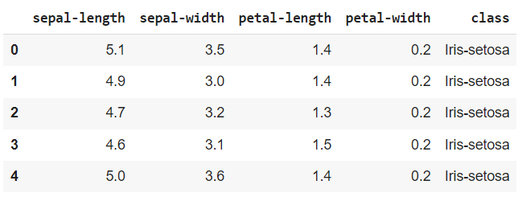

Podemos realizar una inspección de la extracción de la variables de interés, por ejemplo tenemos 4 variables que indican parámetros de medición  de la longitud y ancho de los sepalos y petalos, con un 3 diferentes clases Iris Sentosa, Iris Versicolor y Iris Virginica.


Entonces ya conocidas las variables, las distinciones entre que es un sépalo y un pétalo, podríamos encontrar los estadísticos descriptivos de estas los parámetros de medición.

```python
plt.hist(iris['sepal-length'],color='orange',bins = int(180/5))
```

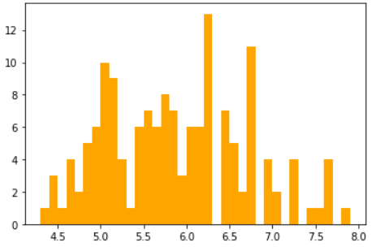

## Gráfico de Kernel Density

El gráfico de la densidad de Kernel es una estimación del histograma a través de una variable continua. Haremos uso de librería seaborn cono el método de `.distplot()`.

```python
sns.distplot(iris['sepal-length'],hist=True,kde=True,bins=int(180/5),color='orange')
```

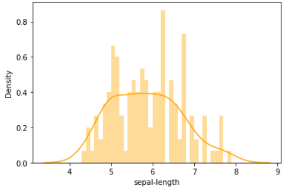

## Varianza y Desviación Estandar Poblacional

La expresión para hallar la variación es la siguiente:

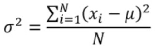

Utilizaremos los métodos de pandas para el calculo de la variación y desviación estándar, para ello tendremos que observar el método `.var()` y `.std()` tienen un parámetro `ddof`, el cual sera el divisor `N-ddof`, por defecto este parámetro sera 1, como la formula tanto de la desviación estándar como varianza poblacional el divisor es N, entonces debemos acotar el colocar un `ddof=0` en el parámetro que le pasemos al método.

```python
iris['sepal-length'].var(ddof=0)
```

Con un resultado de $\sigma^2=0.68$. Para obtener la desviación estandar sera:

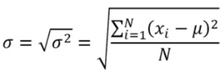

```python
iris['sepal-length'].std(ddof=0)
```

Obteniendo un valor de $\sigma=0.82$. Ahora para hallar la media usaremos el metodo de `.mean()` que propociona el uso de la libreria de pandas.

```python
iris['sepal-length'].mean()
```

Con un resultado de media poblacional de $\mu = 5.84$. Ahora como sabemos si nuestra desviación de datos es alta o baja, pues usaremos un parametro conocido como coeficiente de variación.

## Coeficiente de Variación

### Calculo del coeficiente de variación

$$
C_V = \frac{\sigma}{\mu} *100\%
$$

- Si $C_V$ es menor o igual al 30%, se dice que la media aritmética es representativa del conjunto de datos, y se llama al conjunto de datos como **Homogeneo**. 
- Por otro lado, si $C_V$ es mayor al 30% la media no sea representativa en el conjunto de datos, y resultara en un conjunto **Heterogeneo**

```python
coef_var = iris['sepal-length'].std() / iris['sepal-length'].mean()

if (coef_var <= 0.3):
  print(str(coef_var.round(2))+'\n'+'La media es representativa y se trata de un conjunto Homogeneo')
else:
  print('La media no es representativa y se trata de un conjunto Heterogeneo')
```

Con esto hallamos que el $C_V = 14\%$ que es menor al 30%, por cuanto la media es representativa, nos encontramos con un conjunto Homogeneo y ademas tenemos una desviación baja.

## Creación de una muestra usando muestreo aleatorio simple

Si recodamos los tipos de muestro que existen, el mas sencillo era utilizar el muestreo aleatorio simple, si tomamos un fracción de la población del 50%, utilizaremos:

```python
muestra = iris.sample(frac=0.5)
```

En consecuencia obtenemos los valores de varianza, desviación muestral y media **muestrales**.

## Varianza y Desviación Estandar Muestrales

Ahora si recordamos colocamos el parámetro de `ddof=0` para que modificar el divisor de la expresión en calculo población, como estamos en el caso muestral no hará falta colocar este parámetro, por cual tendremos:

```python
muestra['sepal-length'].var()
muestra['sepal-length'].std()
muestra['sepal-length'].mean()
```

Obteniendo valores como $s^2=0.67,s=0.81$ y $\bar{X}=5.83$.

## Solución al reto planteado

Si analizamos los parámetros del set de datos, nos encontramos con 4 variables agrupadas en 4 categorías o clases que son Iris-Sentosa, Iris-VersiColor, y Iris-Virginica. Podemos obtener la gráfica de la densidad de kernel a traves de la librería seaborn y utilizando el método `kdeplot`, usando los parámateros de `data=iris` y seleccionado la variable a analizar.

```python
sns.kdeplot(data=iris,x='sepal-width',hue='class',fill=True,multiple='stack')
```

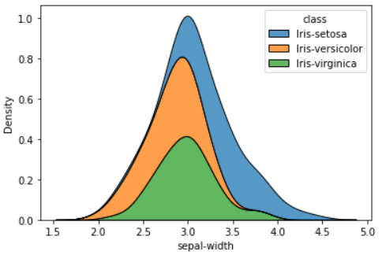

```python
sns.kdeplot(data=iris,x='petal-length',hue='class',fill=True,multiple='stack')
```

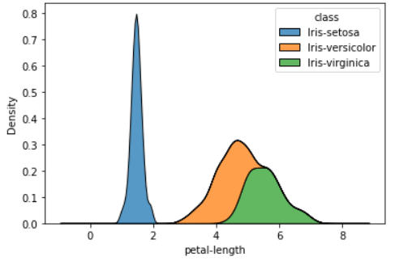

```python
sns.kdeplot(data=iris,x='petal-width',hue='class',fill=True,multiple='stack')
```

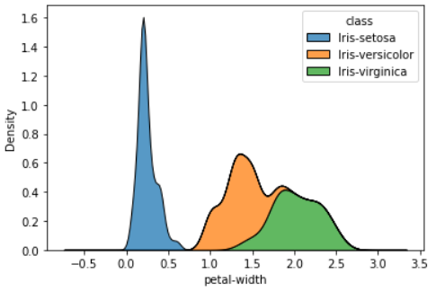

### Parámetros Poblacionales

Usando los métodos de `.var(ddof=0)`, `.std(ddof=0)` y `.mean()` encontramos la varianza, desviación estándar y media **poblacionales** para las tres variables faltantes:

```python
# Parametros carateristicos de sepal width
par_sepal_width = [iris['sepal-width'].var(ddof=0), iris['sepal-width']
                   .std(ddof=0),iris['sepal-width'].mean()]

print(par_sepal_width)

# Parametros carateristicos de petal length
par_petal_length = [iris['petal_length'].var(ddof=0), iris['petal-length']
                   .std(ddof=0),iris['petal-length'].mean()]

print(par_petal_length)

# Parametros carateristicos de petal width
par_petal_width = [iris['petal_width'].var(ddof=0), iris['petal-width']
                   .std(ddof=0),iris['petal-width'].mean()]

print(par_petal_width)
```

Con esto generamos vectores con el siguiente orden $[\sigma^2,\sigma,\mu]$ y con los siguientes resultados:

$Sepal Width = [0.18,0.43,3.05]$

$Petal Length = [3.09,1.75,3.75]$

$Petal Width = [0.57,0.76,1.19]$

### Parámetros Muestrales

Para el muestreo aleatorio simple de una fracción del 50% de la población sera:

```python
muestras_sepal_width = iris['sepal-width'].sample(frac=0.5)
muestras_petal_length = iris['petal-length'].sample(frac=0.5)
muestras_petal_width = iris['petal-width'].sample(frac=0.5)
```

Usando los métodos de `.var()`, `.std()` y `.mean()` encontramos la varianza, desviación estándar y media **muestrales** para las tres variables faltantes:

```python
# Parametros carateristicos de sepal width
par_sepal_width_muestral = [muestras_sepal_width.var(), muestras_sepal_width.std(),muestras_sepal_width.mean()]

print(par_sepal_width_muestral)

# Parametros carateristicos de petal length
par_petal_length_muestral = [muestras_petal_length.var(), muestras_petal_length
                   .std(),muestras_petal_length.mean()]

print(par_petal_length_muestral)

# Parametros carateristicos de petal width
par_petal_width_muestral = [muestras_petal_width.var(), muestras_petal_width
                   .std(),muestras_petal_width.mean()]

print(par_petal_width_muestral)
```

$Sepal Width = [0.17,0.41,2.96]$

$Petal Length = [3.19,1.78,3.83]$

$Petal Width = [0.61,0.78,1.19]$

**Colaboración realizada por:** David Castillo
La medida de un **intervalo de confianza** (IC) nos indica un **rango de valores** dentro de los cuales se encuentran **valores significativos** de una población. En este rango de valore se tendrá limites confidentes, que son los valores de LI (Limite Inferior) y LS (Limite Superior).

Existen varios pares de números que representan distintos **niveles de confianza** $(1-\alpha)$, en cada uno de los intervalos de confianza nos indicaran cuales son las concentraciones de población entre estos pares de números. 

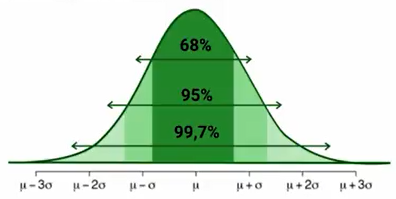 

Como la distribución gaussiana es simétrica respecto a la media, entonces tendremos desviaciones tanto a la izquierda y derecha con las cuales podremos hallar estos intervalos de confianza.

Si decimos que nuestro intervalo debe tener un intervalo de confianza debe tener un indice de confianza del 95%, estamos siendo muy estrictos y pedimos que con 95% de certidumbre un valor se encuentre en un intervalo tomado.

Existen 3 valores mas usados a la hora de calcular un intervalo de confianza y son el 68%, el 95% y el 99.7% que generalmente se relacionan con los valores de $\mu+\sigma$, $\mu+2\sigma$ y $\mu+3\sigma$ respectivamente. Cuando es un estudio experimental generalmente se puede usar un indice de confianza del 68%, mientras que para un estudio mas serio, debemos ser mas estrictos y escoger valores de 95% y 99.7%.

Cuando trabajamos con datos, intentamos alcanzar una decisión en base a una hipótesis o conjeturas que se aplican a una población. Aquí usamos un concepto denominado **Hipótesis estadística**, y son **enunciados en base a las distribuciones de probabilidad** de las poblaciones, estas pueden ser **ciertas** o **falsas**.

## Nivel de Significación

El nivel de significactivo $\alpha$ sera el limite para juzgar si un resultado es o no es estadísticamente significativo. **Si el valor de significación es menor que el nivel de significación $(1-\alpha)$, el resultado es estadísticamente significativo**.

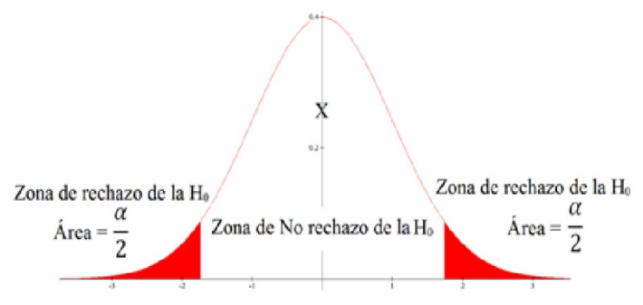

### Interpretación de resultado

En un ejemplo de edades de las personas que esquían, se interpreta que en un intervalo de confianza con un indice del 95% de certeza las edades de las personas que esquían están entre dos valores y aun así tenemos un 5% de probabilidad que sean otros valores.

**Contribución realizada por:** David Castillo
Para realizar el **cálculo del intervalo de confianza** de una distribución normal y encontrar los valores mínimo y máximo en un set de datos, podemos conocer tanto la media, desviación estándar y la varianza como también no conocer estos estadísticos descriptivos. 

## Cuando NO conocemos la información de la población.

Si deseamos saber cuales son los valores mínimo $-Z_{\alpha/2}$ y máximo $Z_{\alpha/2}$ para un indice de confianza del 95%, debemos recordar que en cada uno de los extremos de la distribución representaran 2.5%. Recuerda estamos modelando sobre una forma de distribución normal, es decir que es simétrica para una media población cero.


Nos ayudaremos para realizar el cálculo de estos limites con la tabla Z, usando el indice de confianza 95%, buscaremos el parámetro de tanto $P(X\leq z)= 0.95 + 0.025 = 0.975$, buscamos este valor en la tabla, donde en columna $z$ nos dará el valor numérico con su primer decimal, mientras que la fila $z$ nos dará el valor numérico de su segundo decimal.


De esta manera el numero con su primer decimal sera 1.9, mientras que el segundo decimal a seleccionar sera 0.06, de manera que el limite máximo sera $Z_{\alpha /2}= 1.96$, como estamos tratanto de una distribución normal, entonces es simetría respecto a una media cero, por cuanto $-Z_{\alpha /2}=-1.96$. Así nuestro Intervalo de confianza estará definido por:

$IC_{95\%}=(-1.96 ; 1.96)$


De esta manera lo menos que podemos seleccionar con un 95% de confianza es el -1.96, mientras que el valor máximo que podemos elegir es el 1.96. Pero recuerda que esta interpretación es cuando no tenemos conocimiento de los estadísticos descriptivos de nuestra distribución.

## Cuando SI sabemos información de la población.

Cuando ya tenemos los estadísticos descriptivos de nuestra población o muestra, como lo son la media, varianza, desviación estándar, podemos tener mas precisión acerca de nuestro modelo de investigación.

**Ejemplo._ La duración en días de un cepillo de dientes se ajusta a la distribución normal (28,4). Cual es el intervalo de confianza al 80%.**

Aqui sabemos que la media $\mu=28$ mientras que la varianza $\sigma^2=16$ y su desviación estándar sera $\sigma = 4$.

Ahora verificamos en la posición donde nuestro nivel de confianza sea el 80%, tendremos un $\alpha=20%$ o 0.2, por cuanto en cada extremo tendremos un 0.1 y el valor para encontrar el $Z_{\alpha/2}$ sera de un $P(X\leq z)= 0.8+0.1=0.9$ , por cuanto:


Como no existe un valor preciso en la tabla de 0.9, seleccionamos el mas cercano, en este caso sera 0.8997 y encontramos que nuestro valor de $Z_{\alpha /2}=1.28$, como es simétrico el limite mínimo sera $-Z_{\alpha/2}$. A través de este valor y el parámetro de normalización (formula):

$Z = \frac{x-\mu}{\sigma}$

De esta formula tenemos el parámetro de Z, por lo que debemos despejar el valor x:

$x = \sigma Z+\mu$

Reemplazando los limites serán:

$x_1 = (4)(-1.28)+28=22.88$

$x_2=(4)(1.28)+28=33.12$

Con estos valores hemos encontrado los valores de mínimo y máximo de nuestro intervalo de confianza:

$IC_{80\%}=(22.88 ; 33.12)$

La interpretación de este intervalo dirá que la duración mínima de un cepillo sera de 22.88 días, y la duración máxima sera del 33.12 días, esto con un nivel de confianza del 80%.


**Contribución realizada por:** David Castillo
Usamos Google Colab para realizar el código de Python y comenzamos utilizando las librerías tradicionales como `pandas`, `numpy`, `seaborn` y una librería nueva como `scipy.stats`, para usar los algoritmos estadísticos de esta [librería](https://docs.scipy.org/doc/scipy/reference/stats.html?highlight=scipy%20stats#module-scipy.stats).

```python
import pandas as pd
import numpy as np
import matplotlib.pyplot as plt
import seaborn as sns
import scipy.stats as st
```

> Para esta articlase modelamos un problema de telecomunicaciones usando una modulación de 16 PAM, esto quiere decir que existirá 16 niveles de tensión a transmitir que hipotéticamente serán de 0 a 16 [V], por cuanto introducimos ruido gaussiano a cada símbolo con una densidad de potencia de 1 W/Hz. es decir $\sigma^2 = 1$.

```python
np.random.seed(50)
var1 = np.random.randint(0,16,50) # Simbolos Transmitidos PAM
var2 = var1 + np.random.normal(0,1,50) 
# Ruido Introducido, Simbolos + Ruido de densidad espectral de 1 W/Hz
```

## Visualización de Resultados con un Intervalo de Confianza del 80%

Para visualizar los resultados hacemos uso de la regresión lineal con `sns.regplot()` eh enviado nuestro parámetro de intervalo de confianza (conficence interval CI) en el método de regresin.

```python
grafico = sns.regplot(var1, var2, ci=80, color='orange')
plt.ylabel('Simbolos+ Ruido')
plt.xlabel('Simobolos Transmitidos')
```


Para descartar los datos atípicos, hacemos uso del intervalo de confianza y sus limites inferior y superior. De manera que generamos primero una tupla.

```python
tuple = list(zip(var1,var2))
tabla = pd.DataFrame(tuple,columns=['Simbolos Transmitidos','Señal + Ruido'])
tabla.head()
```

Hacemos uso de la libreria de scipy.stats con `st`, usando una distribuciones de variables continuas `t`, y por ultimo usamos el metodo `interval` para hallar el intervalo de confianza (confidence interval CV).

Si la cantidad de muestras es menor a 30, usamos:

```python
  st.t.interval(alpha, df, loc, scale)
```

Mientras que si la cantidad de muestras es mayor a 30 usaremos: 

```python
  st.norm.interval(alpha, loc, scale)
```

Como usaremos valores mayores a 50, entonces usaremos `st.norm.interval` en donde sus parametros a analizar seran:

- `alpha = 0.95`: Esto debido a que se quiere un IC con un indice del 95%.
- `loc = np.mean(tabla)`: Enviamos el parametro de la media para ue nos devuelva los limites de acuerdo a la caracteristica del conjunto de datos.
- `scale = st.sem(tabla)`: Error estándar de la media $SE = \frac{\sigma}{\sqrt{n}}$, esto nos indica que el error de muestreo disminuye cuando crece el numero de muestras.

```python
# 95
st.norm.interval(alpha = 0.95, loc = np.mean(tabla), scale = st.sem(tabla))
```

$IC_{95\%}(6.85 ; 8.22) \ | \ Símbolos \ Transmitidos$

$IC_{95\%}(7.14 ; 8.57) \ | \ Símbolos + Ruido$

Esto nos menciona los valores mínimo y máximo de voltaje que pueden tener los símbolos transmitidos y al pasar por un canal de característica gaussiana.

## Reto - Cálculo para otros niveles de significación

### Para un indice de confianza del $(1-\alpha)=68\%$

```python
#68
st.norm.interval(alpha = 0.68, loc = np.mean(tabla), scale=st.sem(tabla))
```

$IC_{68\%}(6.85 ; 8.22) \ | \ Símbolos \ Transmitidos$

$IC_{68\%}(7.14 ; 8.57) \ | \ Símbolos + Ruido$

### Para un índice de confianza del $(1-\alpha)=99.7\%$

```python
#99.7
st.norm.interval(alpha = 0.997, loc = np.mean(tabla), scale=st.sem(tabla))
```

$IC_{99.7\%}(5.49 ; 9.58) \ | \ Símbolos \ Transmitidos$

$IC_{99.7\%}(5.73 ; 9.98) \ | \ Símbolos + Ruido$

**Contribución realizada por:** David Castillo
