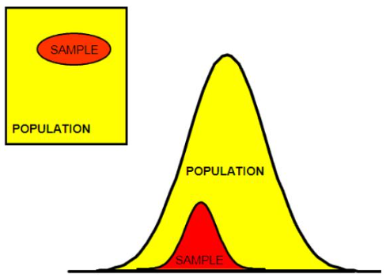
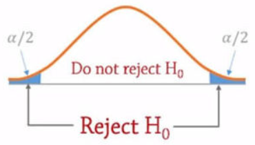

Una **Hipótesis** es una **suposición** posible o imposible que es originada de una consecuencia. Por cuanto sera una proposición no demostrada que sirve para realizar estudios de investigaciones y experimentos.

## Veracidad de una Hipótesis

Las hipótesis deben ser puestas a un proceso para determinar su veracidad, y de serlo debe verse con que probabilidad es verdad la hipótesis.  La forma de poner a prueba una hipótesis es contrastarla con la información extraída y de una distribución de probabilidad la población, esta distribución sera visto como un parámetro general. Por lo tanto para validar una hipótesis se necesita realizar una **prueba o test de hipótesis** sobre este parámetro general.

## Que es una prueba de hipótesis?

Una **prueba de hipótesis** es un procedimiento que se basa en la evidencia muestral. En todo contraste de hipótesis existes dos posibles supuestos.

1. La **hipótesis nula** $H_0$, es la hipótesis mas aceptada, y define un valor predeterminado.

2. La **hipótesis alternativa** $H_1$, es aquella que se acepta en caso de que la hipótesis nula $H_0$ sea rechazada.

:::(Info) (Prueba de Hipótesis)
La prueba hipótesis realiza un proceso de diferenciación entre el tamaño de la muestra con el parámetro general.
:::

### Ejemplos de Hipótesis Nula e Hipótesis Alternativa.

| Hipótesis Nula $H_0$                                                                 | Hipótesis Alternativa $H_1$                                                                 |
| ------------------------------------------------------------------------------------ | ------------------------------------------------------------------------------------------- |
| Se vende cerveza por igual, no importa si es verano o no.                            | En verano, se vende mas cervezas por el hecho de que hace mas calor.                        |
| La venta de zapatillas se mantiene constante a pesar que se va celebrar una maratón. | La venta de zapatillas deportivas se incrementa cuando se celebra una maratón en al ciudad. |

## Pasos de la prueba de Hipótesis

1. Establecemos la **Hipótesis Nula** $H_0$ y la **Hipótesis Alternativa** $H_1$.
   
   De la distribución de la población podemos definir hipótesis a través de una distribución hipotética. 
   
   

2. Seleccionamos un **nivel de significación** $(1-\alpha)$. Recordemos que podemos delimitar la significación de un valor a través de un intervalo de confianza $IC$. El nivel de significancia es importante tenerlo en cuenta ya que si recordamos los sugeribles eran 68%, 95% y el 99.7%, pero pueden existir casos en que de acuerdo al estudio, empresa, mercado entre otros factores, estos niveles de confianza cambien.

3. Seleccionamos el **estadístico descriptivo** ($\mu,\sigma$) de prueba. Por lo general se escoge la media para realizar la comparación.

4. Formulamos la **regla de decisión**.
   
   **Prueba Bilateral:** Se limita en un intervalo de valores con un indice de confiabilidad, obteniendo dos zonas de rechazo de la hipótesis nula $H_0$.
   $H_0:\mu=X$
   $H_1: \mu \neq X $ 
   
   Por ejemplo si un valor se aleja tanto de la zona de no rechazo de H0, voy a tener que considerar la hipótesis alternativa.
   
   
   
   **Prueba Unilateral:** Se define a una zona de rechazo de la hipótesis nula $H_0$ con una sola cola de la distribución.
   $H1: \mu > X$
   $H1: \mu < X$
   
   

5. Interpretamos los resultados  y tomamos una decisión.
   
   Por ejemplo, del caso de la venta de cervezas en verano, si observamos que media en esta época crece lo suficiente para rebasar la zona de aceptación de $H_0$, entonces interpretamos que la hipótesis alternativa es verdadera y una acción a tomar seria que una semana antes de verano aumentemos los suministros de cerveza o que se haga promoción de la cerveza.

## Valor p

El valor p es una probabilidad que se calcula con un valor observado de una muestra en la distribución de la población, y se realiza a través de la tabla Z con el valor de $Z=\frac{\bar{X}-\mu}{\sigma}$. 

Con este valor podemos también aceptar o rechazar una hipótesis. Si ya tenemos el nivel de significacia $(1-\alpha)$ en una distribución, podemos deducir que si el valor p es mayor a $\alpha$ no podemos rechazar la hipótesis nula, y si es menor, debemos rechazarla y considerar la hipótesis alternativa.

Por ejemplo, para un nivel de significacia del 95%, si obtenemos el valor p entonces:

- Si $p>5\%$ no podemos rechazar la hipótesis nula.

- Si $p<5\%$ rechazamos la hipótesis nula y aceptamos la hipótesis alternativa.

**Contribución realizada por:** David Castillo
